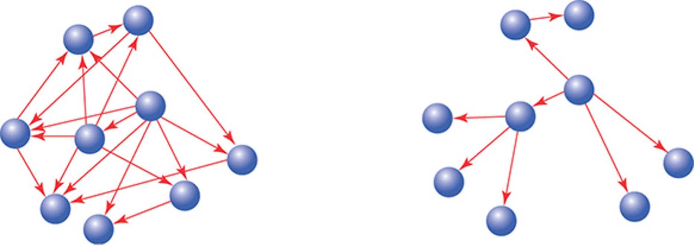

# 5. Interface

As mentioned earlier, OOP is directly related to messages sent between objects. Moreover, it is important not only what objects know what behavior they have inside, on whom they depend (to whom messages are sent), but also how they communicate with each other. Objects communicate through interfaces.

Figure 5.1 - Interface

**Public Interfaces**
- Reveal its primary responsibility.
- Are expected to be invoked by others.
- Will not change on a whim.
- Are safe for others to depend on.
- Are thoroughly documented in the tests.

**Private Interfaces**
- Handle implementation details.
- Are not expected to be sent by other objects.
- Can change for any reason whatsoever.
- Are unsafe for others to depend on.
- May not even be referenced in the tests.

What do interfaces give us? The presence of interfaces allows you to think about the task in a more abstract way, ignoring minor details. There are different levels of abstraction or ignorance of details.

## 5.1 When Should a Class Implement an Interface?

1. Class implements Strategy pattern, or it is part of family of objects: IRepository, IFormatter, IPrecondition.
2. Class implements role interface (as a result of ISP): ICloneable, IComparable, etc.
3. Class implements interface required for connection with other classes. Class is an Adapter, the need for an interface is determined by DIP;
4. Class implements interface, because external environment depends on it. Provides testability to users of this class. This is not a single reason to create an interface.

## 5.2 When Should a Class Depend on an Interface?

When should a class depend on an interface? For example, getting it through the constructor. The arguments of the class indicate that he cannot take some decision on his own, and he needs help from the called class. It's easiest when a class depends on primitives, a little more complicated when it depends on specific classes, and most difficult when it depends on an interface.
1. Class deals with family of types: the "family of types" exists already and defined by requirements of existing model.
2. As a result of DIP: class wants to communicate with object of another level, it defines the interface by itself and requires its implementation.
3. For testing purposes: useful in case if implementation of the abstraction relies on external environment.

:::caution
Don't create interfaces "Just in case"!
:::

    

        Figure 5.2 - Simple sequence diagram
         
         
        
    

    

        Figure 5.3 - Moe talks to Trip and Bicycle
         
         
        
    

Each route is rated according to its difficulty. Mountain bike rides have an additional difficulty rating. Clients have a certain level of fitness and technical skill level for mountain biking, based on this we can determine if the requested ride is suitable for them.

Customers can rent bicycles, or they can bring their own.

Should the Trip class be responsible for figuring out if there is a suitable bike for each given trip? Or more generally "Should the recipient of this message (`Trip`) be responsible for responding to this message?"

The Trip class will respond to the `suitable_trips` message, and the Bicycle class will respond to the `suitable_bicycle` message. The customer can get the result if it communicates with 2 objects. Asking for "What" Instead of Telling "How".

    

        Figure 5.4 - Trip tells a Mechanic how to prepare each Bicycle
         
         
        
    

    

        Figure 5.5 - Trip asks a Mechanic to prepare each Bicycle
         
         
        
    

1st diagram: the `Trip` is almost ready, and it needs to make sure that all the bicycles that will be participating in it are ready for it. Thus, the `Trip` must know exactly how to prepare the bike and what messages and in what sequence to send to the `Mechanic`. `Trip` each every bike, it washes it, fixes it and gives it away for a ride.

The downside is that the `Trip` needs to know this whole big `Mechanic` interface, and secondly, if the mechanic starts implementing new behavior, we will need to update the `Trip` class.

In the 2nd diagram, `Trip` asks the `Mechanic` to prepare each bike, leaving the implementation details to the `Mechanic`.

This refactoring greatly improves support and extensibility. But this is not an ideal solution yet, because `Trip` knows about bicycles as well as about mechanics, perhaps in the future this interface can also be reduced.

**Using Messages to Discover Objects**

    Figure 5.6 - Moe asks the TripFinder for a suitable trip
     
     
    

This diagram is already based on refactoring. We have created the `TripFinder` class, which aggregates the `Trip` class and the `Bicycle` class in itself, it refers to the `Trip` class and says - tell us what are the available trips and for each available trip checks the required bike, and the user returns the list of available trips.

At this stage, `TripFinder` implements the logic of working with our internal systems.

## 5.3 Interface vs Abstract Class

| Parameters            | Interface                    | Abstract class              |
| --------------------- | -----------------------------| --------------------------- |
| Multiple inheritances | Implement several interfaces | Only one abstract class     |
| Structure             | Abstract methods             | Abstract & concrete methods |
| When to use           | Future enhancements          | To avoid independence       |
| Adding new methods    | Could be hard                | Easy to do                  |
| Access modifiers      | Only public                  | Public, protected, private  |
| Usage                 | Defines the peripheral abilities of a class | Defines the identity of a class |

An interface is more flexible from a client's point of view: any class can implement any interface. But the interface is **"stiffer"** from the point of view of its developer: it is more difficult to change it (the work of all clients will be broken), restrictions cannot be imposed on the client's constructor, and the code cannot be reused.

Important Reasons For Using Interfaces:
- Interfaces are used to achieve abstraction.
- Designed to support dynamic method resolution at run time
- It helps you to achieve loose coupling.
- Allows you to separate the definition of a method from the inheritance hierarchy

An abstract class is **"stiffer"** from the clients' point of view: the client will be forced to abandon the current base class. But an abstract class is "more flexible" from the point of view of its developer: it allows you to reuse code, restrict the constructor of descendants, allow you to make changes (easily add a virtual method without breaking existing clients), and more clearly define a "contract" with descendants using Template Methods.

Important Reasons For Using Abstract Class:
- Abstract classes offer default functionality for the subclasses.
- Provides a template for future specific classes
- Helps you to define a common interface for its subclasses
- Abstract class allows code reusability.

## 5.4 Summary: Creating a Message-Based Application

1. _Create Explicit Interfaces_ - every time you create a class, declare its interfaces. Methods in the _public_ interface should:
   - Be explicitly identified as such.
   - Be more about what than how.
   - Have names that, insofar as you can anticipate, will not change.
2. _Honor the Public Interfaces of Others_ - do your best to interact with other classes using only their public interfaces.
3. _Exercise Caution When Depending on Private Interfaces_ - despite your best efforts, you may find that you must depend on a private interface, this is a dangerous dependency that should be isolated.
4. _Minimize Context_ - construct public interfaces with an eye toward minimizing the context they require from others. Keep the _what_ versus _how_ distinction in mind; create public methods that allow senders to get what they want without knowing how your class implements its behavior.
