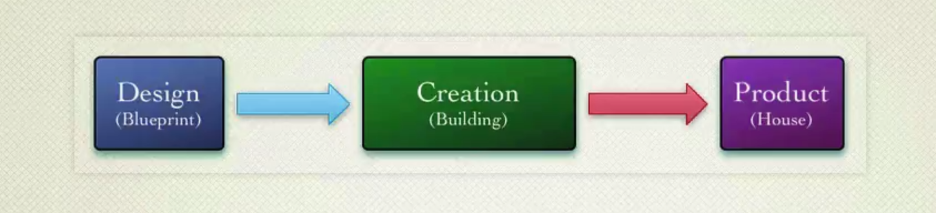
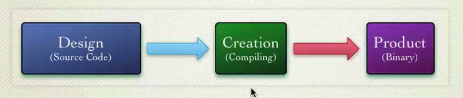

# 6. Object-oriented Design Introduction

Object-oriented design is the process of planning a system of **interacting objects** for the purpose of solving a **software problem**. It is one approach to software design.

Let us look at the words in bold: object interactions and no software problem-solving. Imagine a situation, you are writing a project from scratch, you have a complete list of requirements, and all the necessary information. At the planning stage, we decided how everything would look, there were no questions about the design in general, everything was clear, the architecture was written. Also imagine that after the application is written it will never change. For such cases, the design is not needed, but usually this is quite rare and usually changes always happen and something always changes. For example, clients did not know what they exactly wanted, or they told something wrong. Even applications that are perfect at first glance are also unstable and may change. Because after the release, the customer may want to change it, expand it, add new features, captures other markets, and so on. Therefore, even the most ideal application will not save you from the need for design.

I think you get the idea: applications that are easy to change are always fun to write and extend. Such applications will be flexible in development, adaptable to new requirements, and so on. Conversely, applications that lack such qualities as flexibility and adaptability - each change will be more expensive and more difficult.

## 6.1 Design Smells

Let us look at the criteria for the so-called bad design or the so-called bad design smells, as there are code smells, there are also bad design smells:
- Rigidity
- Fragility
- Immobility
- Viscosity
- Needless Complexity

Rigidity indicates that a system is rigid if it is difficult to change it, or even a small change will entail high costs. This suggests that the system is no longer flexible and extensible.

Fragility indicates that a system is fragile if a change in some part breaks something in another part, while the part in which something breaks is not connected in any way and does not explicitly depend on the part in which something has changed.

Immobility means that a system is immobile if certain parts of it cannot be separated into separate components or into separate modules and reused in another part of this system, and in the best cases, in other systems in general. But this, of course, is even harder.

Viscosity. The system is viscous if basic operations are difficult or take too long to complete. So, they are simply ignored. An example of such operations that are difficult to modify and take a long time are slow tests. If they are hard to run, if they are hard to write, if they are slow to execute, then most likely no one will support them, no one will write them, no one will run them.

Needless Complexity or premature optimization - indicates that the system is unnecessarily complicated or prematurely optimized, has too much code that is not currently used, but was written with the intention that it may be needed in the future if the customer wants what -that functionality, it seems as we prepared for this. In fact, this generates dead code, that is, the code that is not used, first for days, then months, years, and then everyone forgets who wrote it, why it was written, and are simply afraid to delete it, because, it may be used somewhere, but nobody knows where.

In general, the main reason for all the listed bad design smells is the lack of flexibility in the system. The system must be flexible, or, as per saying: software must be soft that is, it must be easy to change. And that is why we need a good design.

## 6.2 What is Design?

Figure 6.1 – Lifecycle of a construction project

Let us imagine the process of creating something. It will have three phases: the actual design phase; the process of creation or construction and the final product.

Let us take construction industry as an example. What will be a design? - Well, obviously a drawing or blueprint. What will the creation process be? - In our case, this will be the construction process in accordance with the ready-made blueprint. And what the final product will be - a house or a building.

As you can see from the diagram, the creation or building process is much bigger than the design process, it is longer and more expensive. That is why there is a need for the blueprint to be well developed at the planning stage, because during the construction process, each change will be too expensive and complicated, and the cost of an error will be too high.

Figure 6.2 – Lifecycle of a software development project

Now let us apply this constructing analogy to the architecture of a software system, just in reverse order. What will be the final product? – An application that solves some specific problems in its domain area. What will be the creation process? – The process of interpreting or compiling source code. And the design process, oddly enough, is the source code itself.

So, in fact, neither diagrams, nor the relationships between them, nor drawings, and so on - they are not design, they help us structure, organize our thoughts into a specific approach and implement it in the form of source code. In this case, the design phase is much longer and more expensive than the creation phase. That is why the design phase should be iterative, gradual, with constant feedback from both the product and the client. In general, this is the main difference between software and, for example, construction. In software, we have one unbreakable constant that will never change throughout the entire time of our development - these are changes, there have always been changes, they will always occur. And this is the reason why we need design as an ongoing interactive process.

## 6.3 Why Change is Hard and the Problem Design Solves

- Object-oriented application is made of parts – objects
- Interactions are embodied in the messages that pass between the objects
- Sender object – Target object creates dependencies between the two
- Object-oriented design is about managing dependencies

Requirements, product, ecosystem, environment, customer ¬ all this will change. The system needs a design that is ready for such changes. Such design would consist of certain parts that would interact with each other to create the behavior of something whole: a class, a component, an architectural layer, or an application. As you understand parts are objects, interactions between them are implemented using messages that are sent between these objects. At the same time, sending the correct message to the correct recipient-object requires knowledge of where this object is and how to interact with it. This knowledge creates a relationship between two or three objects, or generally a huge number of objects in the system. Cross dependencies, cycle-dependency and so on arise. Accordingly, all these dependencies complicate system change. Object-oriented design is essentially dependency management. In the absence of design, unmanaged dependencies lead to chaos, because objects begin to know too much about each other, and at some point, it is easier to throw everything out and rewrite entire application than to add some next changes. Since these dependencies just become unmanageable. By changing something in one place, even if there are some tests, we do not exclude the possibility that something will not break in another place.

## 6.4 The Purpose oF OOD

Software must:
- Satisfy customer's needs
- Be flexible for change and enhancement

Thus, the goal of object-oriented design is just two things. The first is, of course, to satisfy the needs of the customer, and the second is to be easy to change and be adaptable and ready for such changes and extensions.

## 6.5 The Tools of Design

- Design Principles: SOLID, DRY, KISS
- Design Patterns: Creational, Behavioral, Structural
- OOP Principles: Abstraction, Encapsulation, Polymorphism, Inheritance

In fact, there are a lot of approaches and tools, for example, these are the very principles of object-oriented programming: abstraction, encapsulation, etc., which were mentioned at the very beginning of the manual, they are basic, theoretical, but they fit perfectly into the practice of writing code, in the system design and are an essential tool in the fighting complexity, that is, a tool in the creation of object-oriented design. Also, such tools as design patterns: Solid, Dry, Kiss.

We will consider all these principles and tools in subsequent lectures.
