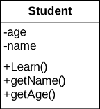
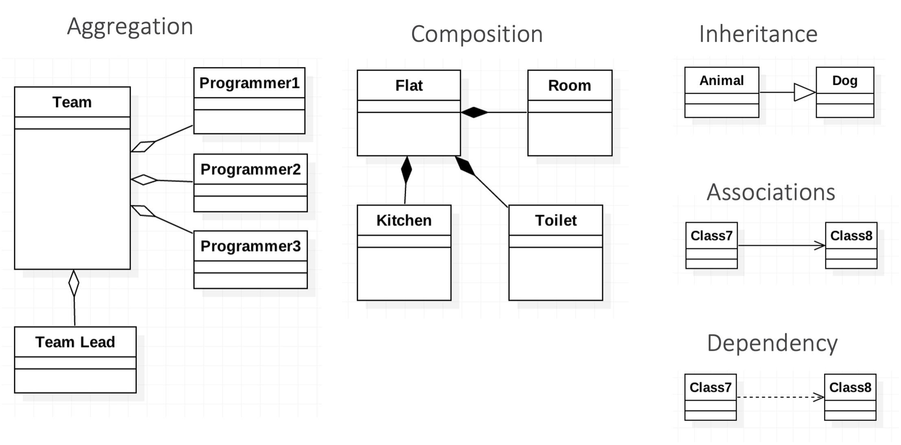
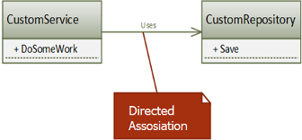
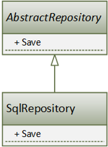
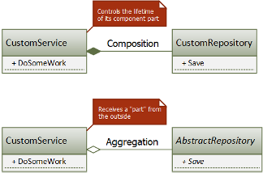

# 2. Unified Modeling Language

## 2.1 What is UML

UML is a general-purpose, developmental, modeling language in the field of software engineering that is intended to provide a standard way to visualize the design of a system.

It is logical to assume that before starting to write code, we need to design our computer system. If the system (program) is small, for example some of your pet-project, then there is no need for visual design, because all the components of this system and their interconnections, in principle, you can keep in your head if you are writing this project alone. As soon as several people appear on the project and information needs to be somehow shared, as soon as the project grows, as soon as the number of components on the project becomes more than ten, you have a certain need for some plan, a representation of your system.

There is a language called UML or Unified Modeling Language for describing system components and their interrelationships. In fact, it gives us a list of terms, abstractions, concepts, and tools for high-level modeling of our system. In principle, the UML is to some extent design patterns in the programming world. When I say that in this part of the system, I need to apply a class that has only one instance to share its state between other components of the system - it will take too long, and we all know perfectly well what it is called a singleton. That is, we have some tools, some concepts, in terms of which we can discuss not some low-level details, but higher-level abstractions. The use of UML is not limited to programming, it is also used for modeling business processes, systems design, drawing up the organization structure, and so on.

Figure 2.1 - UML diagram of Student class



As you can see on the Figure 2.1, there is nothing complicated in the UML. Here is a diagram of the Student class, where at the top you see the name of the class, below is a list of properties that are inherent in this class, even below its behavior, that is, the methods that this class has.

Usually, the system is not limited to just one class, as we have already mentioned, there are tens, hundreds of classes, or even more. Naturally, all these classes somehow interact with each other, somehow communicate, send messages to each other, call each other's methods, send events, and so on. The visual representation of the classes and the relationship between these classes is called class diagrams. There are a lot of relationships, some of the most basic ones are shown in the Figure 2.2.

Let us take a closer look at the relationship between the classes.

Figure 2.2 – UML Relations



## 2.2 Association
There are different types of relationship between two classes / objects. The most basic type of relationship is association, which means that the two classes are somehow related to each other, and we do not yet know exactly how this relationship is expressed and are going to clarify it in the future. This usually happens in the early stages of system design, when we know that there is a relationship, but what specific relationship - inheritance, composition, or something else is not yet clear to us. We are designing the system more globally. The association helps us a lot when we indicate that one class in some way interact with another class. At the initial stage, this is enough for us. Further, of course, this will be clarified. Why is this a directional association? – Because the arrow shows us that we have a component that uses another component. In this case the `CustomService` uses the `CustomRepository` component, and not vice versa.

Figure 2.3 – Directed association



An association is a relationship in which objects of one type are somehow related to objects of another type. For example, an object of one type contains or somehow uses an object of another type. The player plays in a team. We do not yet know what kind of relationship they have, or we are not interested in it at this stage of the design. But we know that there is a relationship.

## 2.3 Inheritance

A more precise type of relationship is the public inheritance relationship (IS A Relationship), which says that everything that is true for the base class is true for its successor. With its help we can get polymorphic behavior, abstract from the concrete implementation of classes, dealing only with abstractions (interfaces or base classes) and do not pay attention to implementation details.

Figure 2.4 – Inheritance relationship



Although inheritance is a great tool in the hands of any OOP programmer, it is clearly not enough for solving all types of problems. Firstly, not all relationships between classes are defined by the "is a" relationship, and secondly, inheritance is the strongest relationship between two classes that cannot be broken at runtime (this relationship is static and, in strongly typed languages, is determined at compile time).

That is, JavaScript, as we all know, has prototypal inheritance and indeed it can be changed for inherited classes, properties can be changed, you can just change prototypes. But this is more an exception rather than a rule. Because you cannot do this in classical inheritance: once inherited in the source code, at run time you will not break this connection, and you will not change the base class. That is why it is believed that inheritance is the strongest relationship between objects. That is why architects and system designers recommend using inheritance only when it is necessary. I think you have heard the concept of preferring composition over inheritance, this suggests that composition can be broken at run time, and you can replace one object in the composition at runtime with another, change the behavior dynamically. You cannot do this with the inheritance.

## 2.4 Composition and Aggregation

When relationships between components go beyond inheritance, relationships such as composition and aggregation come to our rescue. They both model a HAS-A Relationship and are usually expressed in that the class of a whole contains the fields (or properties) of its constituent parts. The line between the concepts is thing, but important, especially in the context of dependency management. We will also talk about dependency management a little later, when we touch on the topic of object-oriented design, because dependency management is one of the tools of object-oriented design.

Figure 2.5 – Composition and Aggregation



A couple of points to make it easier to remember the visual notation:
1. the diamond is always on the side of the whole, and the simple line is on the side of the component.
2. a filled rhombus indicates a stronger bond - composition, an open rhombus indicates a weaker bond - aggregation.

The difference between composition and aggregation is that in the case of composition, the whole explicitly controls the lifetime of its component part (the part does not exist without the whole), and in the case of aggregation, although the whole contains its component part, their lifetimes are not related (for example, the component part is passed via constructor parameters). Listing 2.1.

`CompositeCustomService` uses composition to manage its constituent parts, and `AggregatedCustomService` uses aggregation. In this case, explicit control of the lifetime usually leads to a higher coupling between the whole and the part, since a specific type is used that closely connects the participants with each other.

```js title="Listing 2.1 – Example of Composition and Aggregation"
class CompositeCustomService {
  // Composition
  private readonly repository: CustomRepository = new CustomRepository();

  public doSomething() {
    // Usage of repository
  }
}

class AggregatedCustomService {
  // Aggregation
  private readonly repository: AbstractRepository;
  constructor(repository: AbstractRepository) {
    this.repository = repository;
  }

  public doSomething() {
     // Usage of repository
  }
}
```

Another example of composition. Let us say a bicycle is a whole part and its components (shock absorbers, wheels, handlebars) are parts. In fact, a single shock absorber without a bike makes no sense. An example of aggregation. Suppose there is a university or a school as a whole and teachers, professors as parts, for a certain period they may be part of this university, in some period they may not be included. They can exist without this university after the university is destroyed, that is, its lifetime is over.
