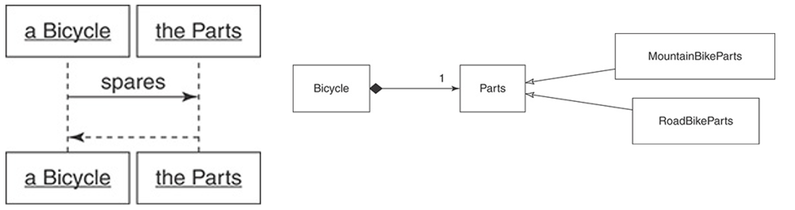
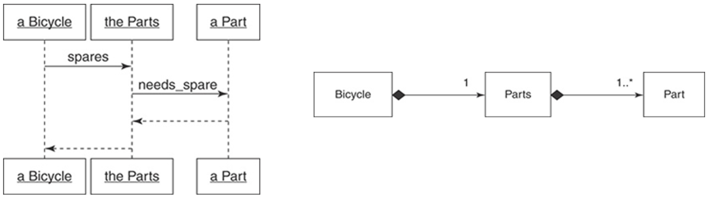

# 1. Composition

## 1.1 What is the Composition

Composition is one of the fundamental concepts in object-oriented programming. It describes a class that references one or more objects of other classes in instance variables. This allows you to model a _HAS-A_ association between objects. You can find such relationships quite regularly in the real world. A car, for example, has an engine and modern coffee machines often have an integrated grinder and a brewing unit. Each part separately may not give us significant value, a musical note, for instance, does not contain a lot of information, while using composition we can create musical composition which can give us much more information than each note separately.

## 1.2 Composition vs Inheritance

Comparing composition with inheritance we can say that inheritance models strong _IS-A_ relation between classes, it means that mountain bike is-a bicycle, while composition models weaker _HAS-A_ relation – mountain bike has-a wheel. Let us go back to the example from the previous lecture.

```ts title="Listing 1.1"
abstract class Bicycle {
  protected readonly defaultChain = '11-speed';

  constructor(opts) {
    this.style = opts.style;
    this.chain = opts.chain || this.defaultChain;
    this.tireSize = opts.tireSize || this.defaultTireSize;
  }

  spares() {
    return {
      chain: this.chain,
      tireSize: this.tireSize
    };
  }
}

class RoadBike extends Bicycle {
  protected readonly defaultTireSize = '28';

  constructor(opts) {
    super(opts);

    this.tapeColor = opts.tapeColor;
  }

  spares() {
    return {
      ...super.spares(),
      tapeColor: this.tapeColor
    };
  }

  protected get defaultChain() {
    return '2-speed';
  }
}

class MountainBike extends Bicycle {
  protected readonly defaultTireSize = '29';

  constructor(opts) {
    super(opts);

    this.frontShock = opts.frontShock;
  }

  spares() {
    return {
      ...super.spares(),
      frontShock: this.frontShock
    };
  }
}
```

Currently, we have abstract class Bicycle** and two subclasses – `RoadBike` and `MountainBike`. If you need continuously extend existing functionality, you will notice that spare parts functionality may not change all the time or will require adjustments because of specific implementations of different subclasses. It becomes too difficult to extend spare parts functionality, and we will use composition to solve this problem.

## 1.3 Moving from Inheritance to Composition

### 1.3.1 1st Refactoring: Composing a Bicycle of Parts: Creating a Parts Hierarchy

Let us refactor current functionality, we will move spare parts to `Parts` class so inheritance will be replaced with composition. You can use UML diagram from Figure 1.1 to better understand what we will get after refactoring.

Figure 1.1 – Bicycle asks Parts for spares and Bicycle has a Parts



```ts title="Listing 1.2"
abstract class Parts {
  protected chain: string;
  protected tireSize: string;

  constructor(opts) {
    this.chain = opts.chain || this.defaultChain;
    this.tireSize = opts.tireSize || this.defaultTireSize;

    this.postInitialize(opts);
  }

  spares() {
    return {
      chain: this.chain,
      tireSize: this.tireSize,
      ...this.localSpares
    };
  }

  protected abstract get localSpares();
  protected abstract get defaultTireSize();
  protected get defaultChain() {
    return '11-speed';
  }
  protected postInitialize(opts) {};
}
```

Now we have separate `Parts` class with all the spares functionality encapsulated inside it. With new approach `Bicycle` type depends on provided parts, when you call spares method inside `Bicycle` it is delegated to `Parts` instance, and it decides which exact parts to return.

```ts title="Listing 1.3"
class RoadBikeParts extends Parts {
  private tapeColor: string;

  postInitialize(opts) {
    this.tapeColor = opts.tapeColor;
  }

  protected get localSpares() {
    return {
      tapeColor: this.tapeColor
    };
  }

  protected get defaultTireSize() {
    return '28';
  }
}

class MountainBikeParts extends Parts {
  private frontShock: string;

  constructor(opts) {
    super(opts);

    this.frontShock = opts.frontShock;
  }

  protected get localSpares() {
    return { frontShock: this.frontShock };
  }

  protected get defaultTireSize() {
    return '29';
  }
}
```

After refactoring you need to pass bicycle size and `Parts` instance to create a new `Bicycle`, you can see it on example below:

```ts title="Listing 1.4"
const roadBike = new Bicycle(
  {size: 'M'},
  new RoadBikeParts({tapeColor: 'red'})
);
const mountainBike = new Bicycle(
  {size: 'M'},
  new MountainBikeParts({frontShock: 'manitou'})
);
```

Now `Bicycle` class is only responsible for its size and for which parts it can consume.

### 1.3.2 2nd Refactoring: Composing a Bicycle of Parts: Creating a Part

But it is not a result, let us continue the refactoring and adjust Parts class to make it look like typed collection. After refactoring our classes structure will look like on UML-diagram below:

Figure 1.2 – Bicycle, Parts and Part relations



```ts title="Listing 1.5"
class Bicycle {
  constructor(private size: string, private parts: Parts) {}

  spares() {
    return this.parts.spares();
  }
}

class Parts {
  constructor(private parts: Part[]) {}

  spares() {
    return this.parts
      .filter(({needsSpare}) => needsSpare)
      .reduce((spares, {name, value}) => ({
        ...spares,
        [name]: value
      }));
  }
}

class Part {
  constructor(
    public name: string,
    public value: string,
    public needsSpare = true
  ) {}
}
```

Now we have three main classes: `Bicycle` class is the same as before the refactoring, `Parts` class composes separate `Part` instances, on diagram it is showed as "one-to-many" relation between `Parts` and `Part` classes. With new approach, theoretically, we can just skip Parts class and just put typed collection directly inside the `Bicycle` class, but we have more than just a collection, we have some additional logic which is related to `Parts` functionality. Each Part instance has `needsSpare` property which indicates if we need to take a spare for this instance of `Part`. If we take a closer look on the `MountainBike`, we will see that it may have rear shock, but we do not need a spare for it. This is logic which `Parts` class contains, without this part of functionality, we may choose the option described above. Below you can see an example how to use new approach.

```ts title="Listing 1.6"
const roadBike = new Bicycle(
  'M',
  new Parts([
    new Part('chain', '11-speed'),
    new Part('tireSize', '28'),
    new Part('tapeColor', 'red')
  ])
);
const mountainBike = new Bicycle(
  'L',
  new Parts([
    new Part('chain', '11-speed'),
    new Part('tireSize', '29'),
    new Part('readShock', 'fox', false),
    new Part('frontShock', 'manitou')
  ])
);
```

### 1.3.3 3rd Refactoring: Composing a Bicycle of Parts: Creating a Part Factory

The next step will help us to further adjust `Parts` creation, as we can use Factory pattern to unify parts creation. On the one hand, this will help us to simplify new `Bicycle` instances creation, but on the other hand, we need to understand that if some functionality will be changed or extended, this may require us to review our abstraction or design pattern. In the current case, Factory can encapsulate all the `Parts` creation inside, so it will look like on example below:

```ts title="Listing 1.7"
const roadConfig = new Set([
  ['chain', '11-speed'],
  ['tireSize', '28'],
  ['tapeColor', 'red']
]);
const mountainConfig = new Set([
  ['chain', '11-speed'],
  ['tireSize', '29'],
  ['readShock', 'fox', true],
  ['frontShock', 'manitou']
]);

PartsFactory.build(roadConfig);
PartsFactory.build(mountainConfig);
```

## 1.4 Composition: Accepting the Consequences of Inheritance

:::info
"Inheritance is specialization." — Bertrand Meyer, Touch of Class: Learning to Program Well with Objects and Contracts.

"Inheritance is best suited to adding functionally to existing classes when you will use most of the old code and add relatively small amounts of new code." — Erich Gamma, Richard Helm, Ralph Johnson, and John Vlissides, Design Patterns: Elements of Reusable Object-Oriented Software 
:::

### 1.4.1 Benefits of Inheritance

- Use of inheritance results in code that can be described as open-closed; hierarchies are open for extension while remaining closed for modification.
- Correctly written hierarchies are easy to extend. The hierarchy embodies the abstraction and every new subclass plugs in a few concrete differences. The existing pattern is easy to follow and replicating. Hierarchies by their nature provide guidance for writing the code to extend them.
- Use Inheritance for _IS-A_ Relationships

### 1.4.2 Cons of Inheritance

- Choosing inheritance to solve the wrong kind of problem.
- High cost of making changes near the top of an incorrectly modeled hierarchy. In this case, the leveraging effect works to your disadvantage; small changes break everything.
- Impossibility of adding behavior when new subclasses represent a mixture of types.

## 1.5 Composition: Accepting the Consequences of Composition

:::info
"Use composition when the behavior is more than the sum of its parts." — paraphrase of Grady Booch, Object-Oriented Analysis and Design
:::

### 1.5.1 Benefits of Composition

- When using composition, the natural tendency is to create many small objects that contain straightforward responsibilities that are accessible through clearly defined interfaces.
- These small objects have a single responsibility and specify their own behavior. They are transparent; it is easy to understand the code, and it is clear what will happen if it changes.
- Because composed objects deal with their parts via an interface, adding a new kind of part is a simple matter of plugging in a new object that honors the interface.
- Use Composition for has-a Relationships.

### 1.5.2 Cons of Composition

- A composed object relies on its many parts. Even if each part is small and easily understood, the combined operation of the whole may be less than obvious.
- The benefits of structural independence are gained at the cost of automatic message delegation. The composed object must explicitly know which messages to delegate and to whom.
- As these costs and benefits illustrate, composition is excellent at prescribing rules for assembling an object made of parts but does not provide as much help for the problem of arranging code for a collection of parts that are very nearly identical.
