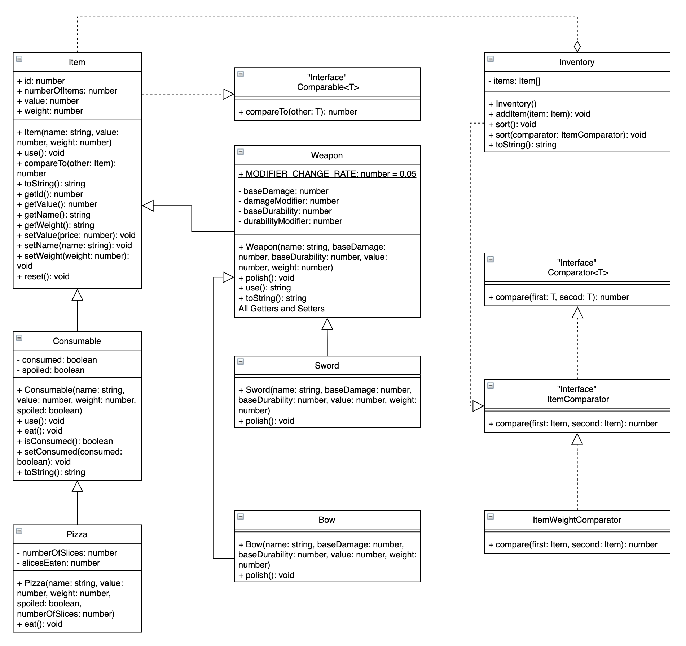
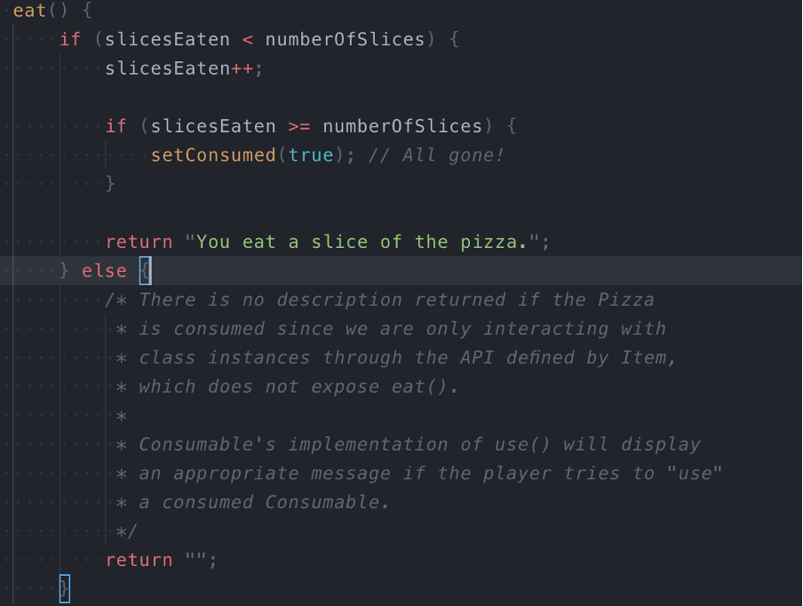

# 6. 📚 Home Task

The home task should be done using TypeScript.

:::info
The starter code for the home task is located in _docs/3-building-blocks-of-oop-part-2/hometask_ folder
:::

Check the UML representation of a set of classes that represent the inventory and various types of items.

The classes and methods in italics are abstract. The concrete child classes must implement all methods from the abstract parent classes. `Item`, `Consumable`, and `Weapon` are the abstract classes.

The line from `Item` to `Comparable` indicates that `Item` must implement the `Comparable` interface. Similarly, the `ItemWeightComparator` class must implement the `ItemComparator` interface, which extends the `Comparator` interface. `ItemWeightComparator` compares items based on their weight.



## Specific Steps

The `Item` class is the common ancestor to the various types of items that can exist in this fantasy game.

- All instances of `Item` are given a unique number id. These are to be assigned by the `Item` constructor. The first instance of an item is assigned an id of 0 (zero); the next is assigned 1, etc. Note that you have available a class variable that will help with the implementation of the constructor (and there is a static `reset()` method).

- `compareTo(other: Item)`: The `Item` class implements the `Comparable` interface. This requires adding the `compareTo(other: Item)` method to the class. The `compareTo(other: Item)` method takes in another instance of `Item` and compares it to the current instance. If the current instance's value field is greater than other's value field then the method should return a positive integer (convention is 1). If the current instance's value field is less than other's value field then the method should return a negative integer (convention is -1). If both items are equal, then compare the name field of the items lexicographically (meaning, compare each character in the strings based on its value, ignoring case. i.e. `A == a`), returning the appropriate value.

- `Item.toString()`: for an `Item` with the name of "ring", a value of 3000, and a weight of 0.013, the method must return a string in the following format (excluding the quotes):

  ```
  "ring − Value: 3000, Weight: 0.01"
  ```

The `ItemWeightComparator` class implements the `ItemComparator` interface, meaning instances of it can be passed to methods requiring a comparator for objects of type `Item`.

- The `compare(first: Item, second: Item)` method of `ItemWeightComparator` should function similarly to the `compareTo(other: Item)` method of the `Item` class, but for the weight field of the `Items`. If the weights are equal, this method should call the `compareTo(other: Item)` method of the first `Item` and return the resulting value.

The `Weapon` class is an abstract implementation of `Item` and describes items that can deal damage and break from use. All instances of `Weapon` have a base damage value `baseDamage` and a modifier to that value `damageModifier`. The sum of these two values determines the effective damage that this `Weapon` can do on a single use. In addition, `Weapons` have a base durability value `baseDurability`, and a modifier to that value `durabilityModifier`. The sum of these two values determines the effective durability of the `Weapon`. When this sum reaches zero or less, the effective durability is zero and the `Weapon` is considered to be broken and cannot be used.

You need to implement the next methods:

- `Weapon.getDamage()`: Returns the effective `Weapon` damage.
- `Weapon.getDurability()`: Returns the effective durability of the Weapon.
- `Weapon.toString()`: for a `Weapon` with the name of "hammer", a value of 300, a weight of 2.032, a `baseDamage` value of 30.4219, a `damageModifier` of 0.05, a `baseDurability` of 0.7893, and a `durabilityModifier` of 0.05, the method returns a string in the following format:

  ```
  "hammer − Value: 300, Weight: 2.03, Damage: 30.47, Durability: 83.93%"
  ```

- `Weapon.use()`: This method returns a string describing what happens when a `Weapon` is used. For a `Weapon` with the name of "hammer", and an effective damage of 30.4725, the method should return the following:

  ```
  "You use the hammer, dealing 30.47 points of damage."
  ```

- "Using" a `Weapon` lowers (subtracts) its effective durability by `Weapon.MODIFIER_CHANGE_RATE`. If the effective durability of the `Weapon` hits or drops below 0, the `Weapon` will "break". If the `Weapon` "breaks", the method should output the previous string, but additionally with a newline character and the additional text "The hammer breaks.":

  ```
  "You use the hammer, dealing 34.05 points of damage. The hammer breaks."
  ```

- For a `Weapon` with the name of "hammer", if it is "broken" (The effective durability is 0 or less), calling its `use()` method returns the following:

  ```
  "You can't use the hammer, it is broken."
  ```

In this case, there is no change to `durabilityModifier`.

The `Sword` class is a concrete implementation of `Weapon` that you must provide.

- All instances of the `Sword` class have the name "sword".
- `Sword.polish()`: This method increases the instance's damageModifier by adding `Weapon.MODIFIER_CHANGE_RATE` each time `polish()` is called, up to 25% of the `baseDamage` value. If the base damage of a sword were to be 100, then the maximum that the effective damage could be increased to would be 125.

The `Bow` class is a concrete implementation of `Weapon` that you must provide.

- All instances of the `Bow` class have the name "bow".
- `Bow.polish()`: This method increases the instance's `durabilityModifier` by adding `Weapon.MODIFIER_CHANGE_RATE`. Any changes are capped such that effective durability is no larger than one (1).

The `Inventory` class is a container for items in this fantasy game. You need to add the following methods:

- `Inventory.sort()`: This sorts the items in the `Inventory` instance based on their value.
- `Inventory.sort(comparator: ItemComparator)`: This sorts the items in the `Inventory` instance based on their weight.
- `Inventory.toString()`: returns string representation of the item list (`.join(', ')`).

The `Consumable` class describes those items that can be eaten by the player. `Consumables` can be marked as consumed, and can be spoiled. These properties are stored in the instance variables consumed and spoiled, respectively. A newly-created `Consumable` object should have its consumed field set to false.

- `Consumable.use()`: If a `Consumable` is not spoiled and is not consumed, calling this simply returns the value from a call to `Consumable.eat()`. For a `Consumable` with the name of "bread" that has already been consumed, this method returns the following:
  ```
  "There is nothing left of the bread to consume."
  ```

Assuming for this `Consumable` named "bread" that the value returned by a call to its `eat()` method is the following:

```
"You eat the bread."
```

If this "bread" were to be spoiled, the method returns this string, appended with a newline and the text "You feel sick.":

```
"You eat the bread.
You feel sick."
```

## Specific instructions

1. Start from creating `Item`, `Consumable`, and `Inventory` classes.
2. Create the `Sword`, `Bow` and `ItemWeightComparator` classes

## Implementation details

1. both int/float types in the UML diagram represents "number" type in Typescript;
2. `Item` class:
   - `numberOfItems` is static getter property which returns `counter` (keep it outside class declaration and increment every time class constructor is executed)
   - `reset()` method should assign 0 to the `counter`
   - `compareTo(other: Item)` - see description above
3. `Consumable` class:
   - consumed is `false` when create new instance
4. `Inventory` class:
   - `items` - `Item[]`
   - `sort()` method is polymorphic and has 2 declarations: `sort()` and `sort(comparator: ItemComparator)`
5. `Weapon` class:
   - don't forget to use `super` in `constructor` (note that parent classes can require extra fields, such as `name`)
6. `Pizza` class:
   - example of `eat()` method:
     

## Evaluation criteria

2. Only some classes were implemented.
3. Some classes were not implemented.
4. Some required methods are missing.
5. All tasks are implemented to a full extend.
