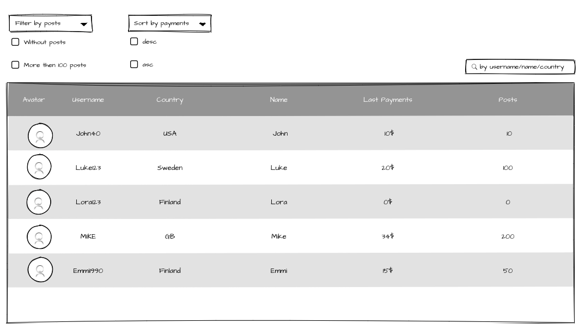
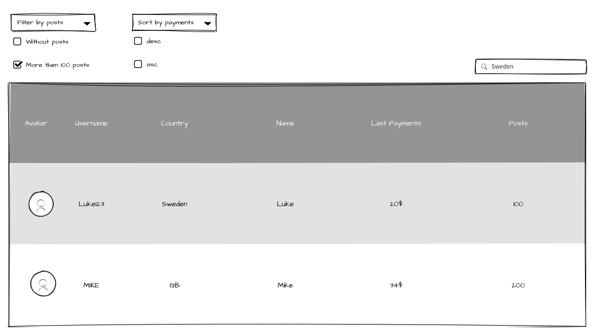
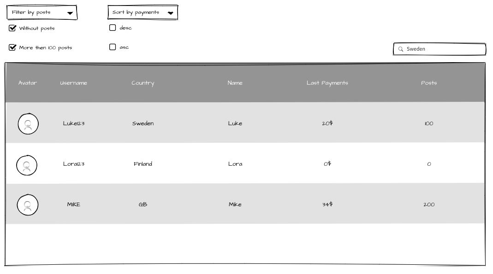
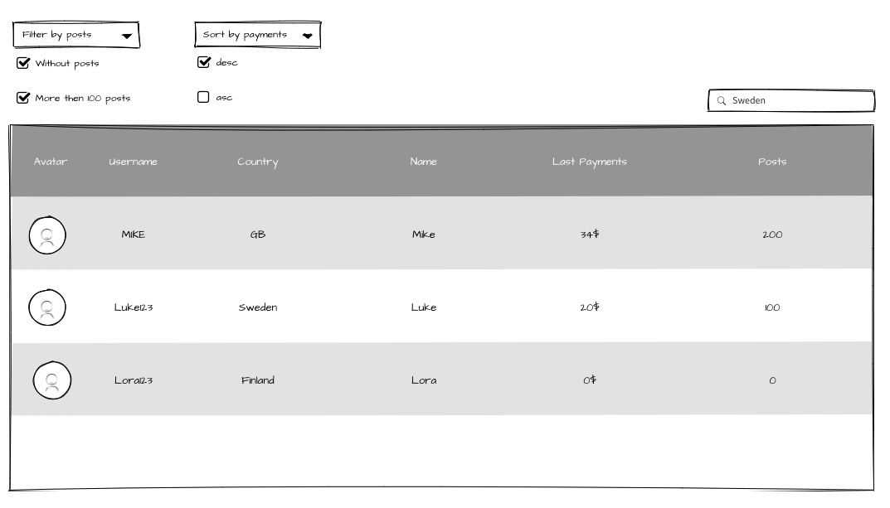

import CodeEmbedLink from '@site/src/components/CodeEmbedLink';

# 5. 📚 Home Task

The home task should be done using TypeScript.

:::info
The starter code for the home task is located in the sandbox bellow:

````mdx-code-block
<CodeEmbedLink
  title="FP hometask"
  src="https://codesandbox.io/embed/fp-hometask-442k6t?fontsize=14&hidenavigation=1&theme=dark"
/>
````
:::

## Start the project

In the project directory, run command bellow to install all required packages:

```bash
 npm install
```

To run the app in the development mode use the following command:

```bash
 npm start
```

Open [http://localhost:3000](http://localhost:3000) to view it in your browser. The page will reload when you make changes. You may also see any lint errors in the console.

## Task

Imagine that you work on the game server, and you need to display some statistics on the UI. In order to do it, you need to get some data from the backend and then show it on the UI.

The backend work is already done, and you have three requests with the needed data.

On UI, you already have implemented components so what you need is to pass data from API to the component and implement some business logic.



## Input parameters

`getImages` - returns array of images (`Image[]`).

```ts
interface Image {
  userID: string;
  url: string;
}
```

`getUsers` - returns array of users (`User[]`).

```ts
interface User {
  userID: string;
  username: string;
  country: string;
  name: string;
}
```

`getAccounts` - returns array of accounts (`Account[]`).

```ts
interface Payment {
  totalSum: number;
  date: string;
}

interface Account {
  userID: string;
  posts: number;
  payments: Payment[];
}
```

The table takes the next array of rows as a parameter (Row[]):

```ts
interface Row {
  avatar: string;
  username: string;
  country: string;
  name: string;
  lastPeyments: number;
  posts: number;
}
```

## Requirements

You need to implement:

1. The first part is to implement is a data converter.

   Like in real life there are three REST API endpoints and each returns an array of objects. On the UI all the received data should be displayed in one table (it is already implemented). However, the table takes one array with the objects (rows). So it is necessary to convert three arrays into one. The response models are provided above.

   The next transformation should be done:

   ```ts
   const dataConverter = (
     users: User[],
     accounts: Account[],
     images: Image[]
   ): Rows[] => {
     // convert data
     return rows;
   };
   ```

2. The second part is to implement some business logic on the page.
   In the future, we will have a lot of data in the table, so it would be hard to find something in there. That is why we need to have a possibility to sort, filter, and search on the page. `Sort`, `Search` and `Filter` have to work as **OR**. For example,

   - if the **More than 100 posts** filter is active, and you type SWEDEN in the `Search` input, the result will be MIKE and Luke123.
     

   - if **Without posts** and **More than 100 posts** filters are chosen and Sweden is typed in `Search` input, the result will be Lora123, Luke123 and MIKE.
     

   - if **Without posts** and **More than 100 posts** filters are active, Sweden is typed in `Search` input and **desc** is selected sorting, the result will be MIKE, Luke123, Lora123.
     

## Specific instructions

1. Search is not case-sensitive. All the options are valid: SWEDEN, sweden and Sweden.
2. The main idea is to follow functional programming principles, such as immutability, avoiding side effects, using a pure function, no shared state, using higher-order components, currying, composition.

## Evaluation Criteria

2. All tasks are implemented partially, or one task is not implemented at all.
3. Two tasks have major issues or functional principles are not followed at all.
4. One of the tasks does not have a major part of its implementation.
5. All tasks are implemented to a full extend and functional principles are followed.
