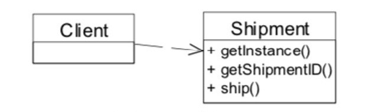
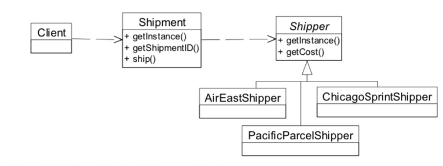
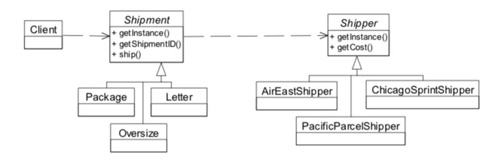
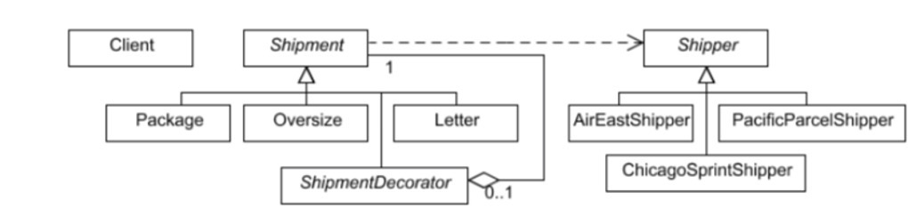

# 6. 📚 Home Task

The home task should be done using TypeScript.

:::info
To complete the home task you need to complete each of the steps described below one by one.
Create at least one commit for each step so your mentor will be able to verify the solution.
:::

### Step 1: Starting Simply

You are coding up the back-end for a Package Handling system. Another team is creating a front-end part, but this is not ready yet. Yet another team is working on a persistence layer which, will be able to generate unique Shipment ID's for you when needed (see below), but this is also not yet ready.

You will need, at minimum, two objects. One will represent the controlling, or `Client` object that will interact with the front-end, when it is available. The other will represent the object being shipped.

State that will come from the end user via the front-end part is the next:

- `ShipmentID` - a number that represents an existing ID, or 0, which means you have to generate a new, unique ID at construction time
- `Weight` - a number, storing the weight of the item in ounces
- `FromAddress` - a string containing street, city, and state, should be changeable
- `FromZipCode` - a string containing exactly 5 characters, should be changeable
- `ToAddress` - a string containing street, city, and state, should be changeable
- `ToZipCode` - a string containing exactly 5 characters, should be changeable

The client object will obtain a single instance of the object which represents the item being shipped, and then ask it to 'ship itself' (calls its `ship` method). The return from this request will be a single string indicating the shipment ID, where the item was sent from, where it is going, and how much the cost was.

The cost will be determined by the weight. The rate of 39 cents per ounce will be applied.

Once the client has this return, it should send it to the console for display.

Things to note:

• Make sure you follow good practices. Always program by intention, and always encapsulate the construction of instances.

• Since you don't have the actual front-end part to get the shipment data, you need to create a mock for it. Just make sure it will be easy to replace the mock with the real implementation in the future.

:::tip
Remember programming by intention tends to produce cohesive methods, which are easier to change and move from place to place.
:::

• Since you don't have the actual persistence layer which can generate unique ID's for you, you'll need to simply generate a unique ID for now. Again, make sure this is as easy as possible to change when the real code is ready. Hint: make a method called `getShipmentID` which, for now, just increases a static int by one and returns it but in the future will get the real shipment ID.

Figure 6.1 illustrates this in the UML.

Figure 6.1 - Client using Shipment



### Step 2: Multiple Shippers

Now you are informed that there are multiple partner companies used to actually ship the item in question. This will affect the per-ounce rate used when cost is determined.

The companies are:

- Air East: Based in Atlanta
- Chicago Sprint: Based in a suburb of Chicago
- Pacific Parcel: Based in San Diego

The correct shipper to use is determined by the zip code of the sender (the "from" zip code). If the from zip code begins with 1, 2, or 3, then the source location is in the east, and Air East will be used. A 4, 5, or 6 as the first digit of the from zip code means Chicago Sprint is the right choice. A 7, 8, or 9 will mean the western US, and therefore Pacific Parcel.

Air East charges 39 cents per ounce, as we are accustomed to paying (they are the vendor we have been using all along).

Chicago Sprint charges 42 cents.

Pacific Parcel charges 51 cents. Things are expensive in southern California!

Note that the "to" zip code does not affect the price. All our vendors have reciprocal agreements for cross-country shipping.

If the zip code is unknown, Air East will be the default.

Figure 6.2 illustrates this in the UML.

Figure 6.2 - Shipment using Shipper as Strategy



### Step 3: Different Kinds of Shipments

Now there are three types of items being shipped: Letters, Packages, and Oversize. The way you know which type of thing is being shipped is determined by weight2.

Regardless of which shipper is being used, the following rules apply:

- A Letter is anything up to and including 15 ounces (less than a pound)
- A Package is anything up to and including 160 ounces
- An Oversize package is anything heavier than 160 ounces

The various shippers have different actions to take, depending on what sort of item is being shipped:

|           | Air West                                        | Chicago Sprint | Pacific Parcel                                              |
| --------- | ----------------------------------------------- | -------------- | ----------------------------------------------------------- |
| Letter    | 0.39 per ounce                                  | 0.42 per ounce | 0.51 per ounce                                              |
| Package   | 0.25 per ounce                                  | 0.20 per ounce | 0.19 per ounce                                              |
| Oversized | $10 flat in addition to standard package charge | No charge      | 0.02 added per ounce in addition to standard package charge |

Figure 6.3 illustrates this in the UML.

Figure 6.3 - Shipments using Shipper as Bridge



### Step 4: Marking Shipments with Special Codes

If selected in the GUI, the Shipment may be marked Fragile, Do Not Leave, and Return Receipt Requested, or any combination of these three. Here again, the GUI is not actually available, so you'll need to stub this out somehow, somewhere.

The effect of this will be that when the Client asks the Shipment to "ship itself", this extra information will appear at the bottom, in all uppercase and surrounded by double asterisks.

Here is an example, with all three marks applied:

```
Shipment with the ID 17263 will be picked up from 12292 4th Ave SE, Bellevue, Wa 92021 and shipped to 1313 Mockingbird Lane, Tulsa, OK 67721
Cost = 5.1
**MARK FRAGILE**
**MARK DO NOT LEAVE IF ADDRESS NOT AT HOME**
**MARK RETURN RECEIPT REQUESTED**
```

Figure 6.4 illustrates this in the UML.

Figure 6.4 - Shipper being decorated



:::note
You may not strictly follow every UML-diagram. If you want to replace some designs pattern to another one, which you think fit better, or you suppose some pattern is redundant here you may not use it (please, add comments why it's redundant). In case of implementation `Shipment` and `Shipper` classes as `Singletons` you may face with issue where `Singleton` can't play role of Base/Abstract class. In such case you can consider using composition instead of inheritance or just to not make those classes as `Singletons` at all.
:::

## Evaluation criteria

2. Only the step 1 is completed.
3. Steps 3 and 4 are not completed.
4. The last step is not completed.
5. All the steps are completed.
