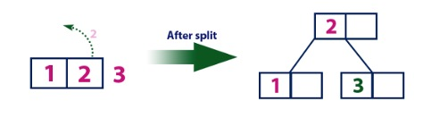

# 4. B-Trees

B-trees are an immensely powerful tools that are used in SQL and in filesystems. They inherited a loft from red-black trees. Let us figure out what they are and how they work.

B-trees are balanced search trees designed to work well on disks or other direct-access secondary storage devices. B-trees are like red-black trees, but they are better at minimizing disk I/O operations. Many database systems use B-trees, or variants of B-trees, to store information.

B-trees differ from red-black trees in that B-tree nodes may have many children, from a few to thousands. That is, the "branching factor" of a B-tree can be quite large, although it usually depends on characteristics of the disk unit used. B-trees are similar to red-black trees in that every n-node B-tree has height `O(lgn)` The exact height of a B-tree can be less than that of a red-black tree, however, because its branching factor, and hence the base of the logarithm that expresses its height, can be much larger. Therefore, we can also use B-trees to implement many dynamic-set operations in time `O(lgn)`.

B-trees generalize binary search trees in a natural manner. Next image shows a simple B-tree. If an internal B-tree node x contains `x[n]` keys, then `x` has `x[n] + 1` children. The keys in node `x` serve as dividing points separating the range of keys handled by `x` into `x[n]` C 1 subranges, each handled by one child of `x`. When searching for a key in a B-tree, we make an `(x[n] + 1)`-way decision based on comparisons with the `x[n]` keys stored at node `x`. The structure of leaf nodes differs from that of internal nodes; we will examine these differences.

Figure 5.1

A B-tree T is a rooted tree (whose root is `T.root`) having the following properties:
- Every node `x` has the following attributes:
  - `x[n]`, the number of keys currently stored in node `x`
  - the `x.n` keys themselves, `x[key[1]]; x[key[2]], …, x[key[x[n]]]`, stored in nondecreasing order, so that `x[key[1]] ≤ x[key[2]] ≤ … ≤ x[key[x[n]]]`
  - `x.leaf`, a boolean value that is `true` if `x` is a leaf and `false` if `x` is an internal node.
- Each internal node `x` also contains `x[n] + 1 ` pointers `x[c[1]];x[c[2]]; … ;x[c[x[n] + 1]]` to its children. Leaf nodes have no children, and so their `c[i]` attributes are undefined.
- The keys `x[key[i]]` separate the ranges of keys stored in each subtree: if `k[i]` is any key stored in the subtree with root `x[c[i]]`, then:
  `k1 ≤ x[key[1]] ≤ k[2] ≤ x[key[2]] ≤ … ≤ x[key[x[n]]] ≤ k[x[n] + 1]`
- All leaves have the same depth, which is the tree's height `h`
- Nodes have lower and upper bounds on the number of keys they can contain. We express these bounds in terms of a fixed integer `t ≥ 2` called the minimum degree of the B-tree:
  - Every node other than the root must have at least `t - 1` keys. Every internal node other than the root thus has at least t children. If the tree is nonempty, the root must have at least one key.
  - Every node may contain at most `2t - 1` keys. Therefore, an internal node may have at most `2t` children. We say that a node is **full** if it contains exactly `2t - 1` keys.

To perform an insertion follow this procedure:
- Check if the tree is empty.
- If tree is empty, create a new node with inserted value and use it as root of the tree.
- If tree is not empty, find an appropriate leaf node to append the value by using b-tree search algorithm.
- If found element has an empty position, add new value to the node, following nondecreasing order.
- If found element is full, split the leaf node, while sending the middle value to the parent. Repeat this process until sent value is added to a node.
- If split is performed on a root node, then create a new root node and add the middle value into it. The tree height is then increased by 1.

Following is an example of adding values 1 through 10 to a b-tree.

Add element 1 by creating a root node.

Figure 5.2

Add element 2 by adding it to a root node.

Figure 5.3

Add element 3 by splitting root node.

Figure 5.4

Add element 4 by adding it to the appropriate leaf.

Figure 5.5

Add element 5 by splitting node with 3 and 4.

Figure 5.6

Add element 6 to the appropriate leaf.

Figure 5.7

Add element 7 to appropriate leaf. Then split the leaf and send middle value (6) up.

Figure 5.8

Add element 8 to appropriate leaf.

Figure 5.9

Add element 9 to leaf with values 7 and 8. Split the node and send the 8 upwards.

Figure 5.10

Add value 10 to node with 9.

Figure 5.11

