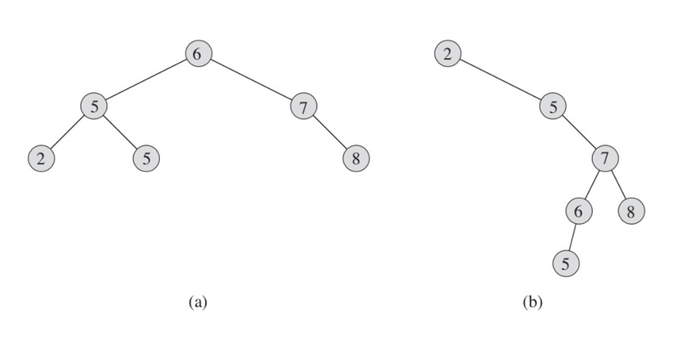
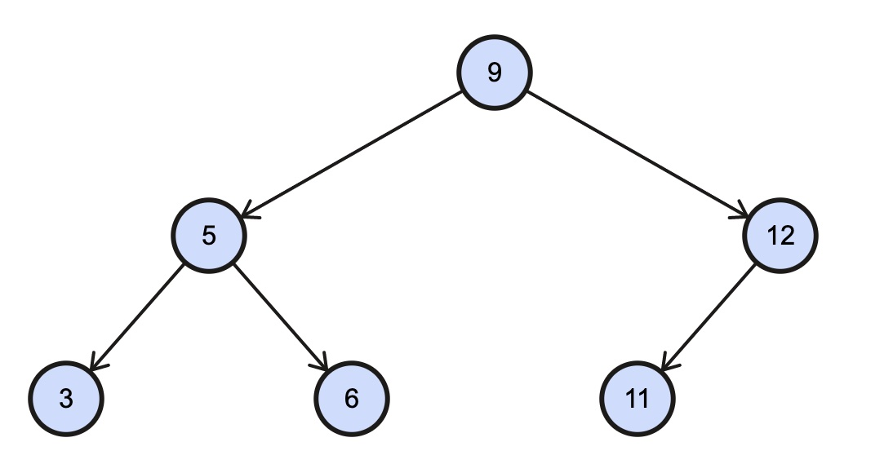
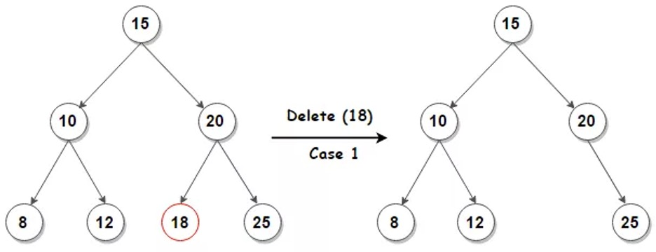
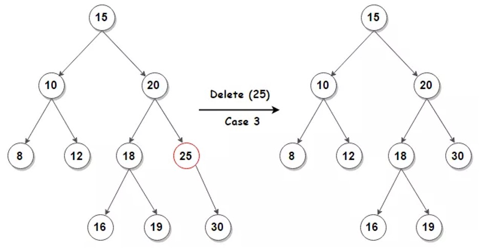
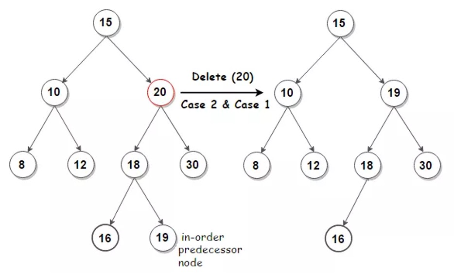

import CodeEmbedLink from '@site/src/components/CodeEmbedLink';

# 2. Binary Search Tree

This data structure is a bit more interesting. With this data structure it's easy to implement a set data type, which is a collection of unique elements. It's also easy to implement operations such as **search**, finding **min** or **max** element in the set and search of **previous** and **next** values. All those operations take `O(logn)` time if the tree is balanced.

Figure 2.1



On the Figure 2.1 you can see a balanced tree on the left and an unbalanced tree on the right. If the tree is balanced, the operations mentioned above will take `Ø(lgn)` where `Ø` - theta. If the tree is unbalanced, the operations will take `O(lgn)`.

**Binary Search Tree** (BST) is a node-based binary tree data structure which has the following properties:
- The left subtree of a node contains only nodes with values smaller than the node's value.
- The right subtree of a node contains only nodes with values bigger than the node's value.
- The left and right subtree each must also be a binary search tree or be `null`.

If a node is to be inserted into a tree, it is compared with current node (starting from the root). If the node's value is less than current, we send it down to left subtree. If node's value is greater than or equal to current - it is sent to the right subtree. This process is repeated for each encountered node.

## 2.1 Tree Walks

The binary search tree property allows us to print out all the values in a binary search tree in sorted order by a simple recursive algorithm, called an **inorder tree walk**. This algorithm is named so because it prints the value of the root of a subtree between printing the values in its left subtree and printing those in its right subtree. (Similarly, a **preorder tree walk** prints the root before the values in either subtree, and a **postorder tree walk** prints the root after the values in its subtrees.)

Listing 2.1 - Binary Tree Traversal

````mdx-code-block
<CodeEmbedLink
  title="Binary Tree Traversal"
  src="https://codesandbox.io/embed/binary-tree-traversal-zhenx4?expanddevtools=1&fontsize=14&hidenavigation=1&theme=dark"
/>
````

Figure 2.2



For example, with a tree in Figure 2.2, those tree walks would give following results:
- Inorder (Left, Root, Right): `3` `5` `6` `9` `11` `12`
- Preorder (Root, Left, Right): `9` `5` `3` `6` `12` `11`
- Postorder (Left, Right, Root): `3` `6` `5` `11` `12` `9`

:::info
The recursive approach is used to implement the Binary Tree Traversal. Check out [here](https://www.collegenote.net/curriculum/data-structures-and-algorithms/41/454/) the advantages and disadvantages of using recursion. Feel free to figure out on your own how to implement the same using iterative approach.
:::

## 2.2 Searching

Because of the BST properties, it's very easy to search for an element with a following function:

Listing 2.2 - searchTree

````mdx-code-block
<CodeEmbedLink
  title="Binary Tree - searchTree"
  src="https://codesandbox.io/embed/binary-tree-searchtree-mq2g4g?expanddevtools=1&fontsize=14&hidenavigation=1&theme=dark"
/>
````

We can always find an element in a binary search tree whose value is a minimum by following left child pointers from the root until we encounter a `null`. The search of a tree's maximum is a symmetric procedure:

Listing 2.3 - treeMinimum and treeMaximum

````mdx-code-block
<CodeEmbedLink
  title="Binary Tree - treeMinimum and treeMaximum"
  src="https://codesandbox.io/embed/binary-tree-treeminimum-and-treemaximum-s0bg2g?expanddevtools=1&fontsize=14&hidenavigation=1&theme=dark"
/>
````

Given a node in a binary search tree, sometimes we need to find its successor in the sorted order determined by an inorder tree walk. If all values are distinct, the successor of a node `node` is the node with the smallest value greater than `node.value`. The strategy has three basic cases:
- in case `tree` and `node` are the same the `null` should be returned
- in that case `node` has a right subtree we need to find the left most node in its right subtree which is also the lowest node in its right subtree
- in that case `node` does not have a right subtree we need to walk down the `tree` node until we match the `node` and return its parent

Listing 2.4 - getSuccessor

````mdx-code-block
<CodeEmbedLink
  title="Binary Tree - getSuccessor"
  src="https://codesandbox.io/embed/binary-tree-getsuccessor-qmk6le?expanddevtools=1&fontsize=14&hidenavigation=1&theme=dark"
/>
````

For an example for Figure 2.2 the inorder successor of `6` is `9`, the inorder successor of `5` is `6` and inorder successor of `3` is `5`.

## 2.3 Insert

To insert a new value `value` into a binary search tree `tree`, we use the function `insertNode`. It takes a node `node` for which: `node.value = value`, `node.left = null`, and `node.right = null` and inserts it into an appropriate position in the tree.

Listing 2.5 - insertNode

````mdx-code-block
<CodeEmbedLink
  title="Binary Tree - insertNode"
  src="https://codesandbox.io/embed/binary-tree-insertnode-rl1ytj?expanddevtools=1&fontsize=14&hidenavigation=1&theme=dark"
/>
````

In the Figure 2.2, we want to insert `7`. We look at `9` and go left, we look at `5` and go right for `6` and insert `7` into its right subtree.

## 2.4 Deletion

The overall strategy for deleting a node `node` from a binary search tree `tree` has three basic cases but, as we shall see, one of the cases is a bit tricky:
- If `node` is leaf (has no children), then we simply remove it by modifying its parent to replace `node` with `null` as its child.
- If `node` has just one child, then we elevate that child to take `node`s position in the tree by modifying `node` parent to replace `node` by `node`s child.
- If `node` has two children, then we find `node` successor `parent` — which must be in `node` right subtree — and have `parent` take `node`s position in the tree. The rest of `node`s original right subtree becomes `parent`s new right subtree, and `node`s left subtree becomes `parent`s new left subtree. This case is the tricky one because, as we shall see, it matters whether `parent` is `node`s right child.

Figure 2.3



In the Figure 2.3, we are removing element `18`. Since it has no children, we set the `20`'s left subtree to `null`.

Figure 2.4



In the second case we are removing element `25`. Since it has only one child - `3`0, we replace the `20`'s right subtree with `30`.

Figure 2.5



In the third case, we are removing element `20`. Node `20` has 2 children. To delete the node we need to find its inorder successor or inorder predecessor. In our example the inorder successor is node `30` and inorder predecessor is node `19`. The inorder successor will be the minimum of the right subtree. The inorder predecessor is going to be the maximum of the left subtree. After replacing the node with found value, we must delete the replacing node.

Listing 2.6 - deleteNode

````mdx-code-block
<CodeEmbedLink
  title="Binary Tree - deleteNode"
  src="https://codesandbox.io/embed/binary-tree-deletenode-cstjdj?expanddevtools=1&fontsize=14&hidenavigation=1&theme=dark"
/>
````

The worst-case time complexity of search, insert, and delete operations is `O(h)` where `h` is the height of the Binary Search Tree. In the worst case, we may have to travel from root to the deepest leaf node. The height of a skewed tree may become `n` (number of nodes), and the time complexity of search and insert operation may become `O(n)`.
