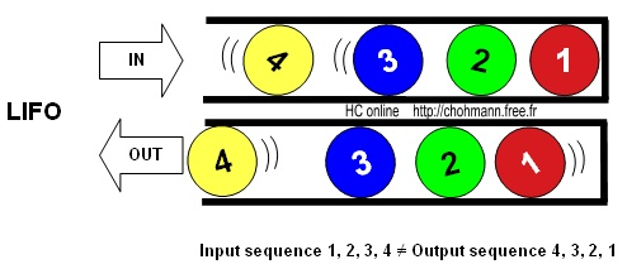
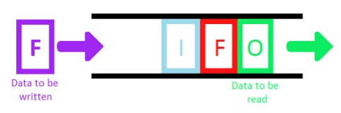
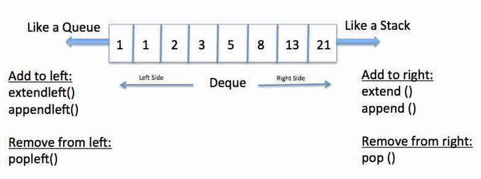
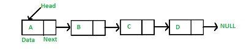
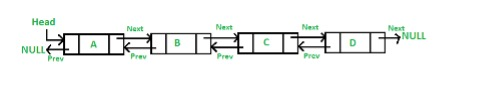
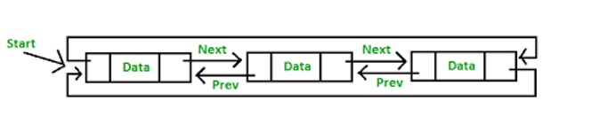
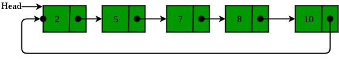

# 1. Elementary Data Structures

This is a finishing part of this course and the last lecture dedicated to data structures and algorithms performed on them. At first, it is better to start with the most simple data structures that implement **last in, first out (LIFO)** and **first in, first out (FIFO) principles**.

## 1.1 Stacks and Queues

Figure 1.1

The first data structure we are going to look at is a stack (Figure 1.1). A **stack** is a dynamic set in which the element removed from the set is the one most recently inserted. The stack implements a **last-in**, **first-out**, or **LIFO** policy.

Figure 1.2

The next data structure we should be aware of is a **queue** (Figure 1.2). A queue is a dynamic set in which the element removed from the set is the on that has been in the set for the longest time. The stack implements a **first-in**, **first-out** or **FIFO** policy.

Those are two types of collections of data with defined operations such as insertions, removals and element search.

Stacks and queues could be used in order to process certain types of operations. For example, we have a function that calls another function, that, in turn calls a different function. Then, the result from the innermost functions are being returned up. In a situation like this it's better to use a stack. We would take the uppermost function, start the execution until we reach a function call. At this moment we would take the state of execution of current function, put it into a stack and start execution of an inner function. This operation is repeated with every inner function. When the execution flow reaches a return statement, an item is removed from the stack and execution continues.

Operations of addition for a stack are usually called **push**, and operations of removal are called **pop**. A **peek** operation is sometimes defined on a stack, with this operation we would look into contents of the top element of the stack without removal. For queue, similar operations are usually called **enqueue** and **dequeue**.

Figure 1.3

There are also data structures that have properties of both a queue and a stack, called double ended queue (Figure 1.3).

It's important to know when to apply each type of data structure. For example, other than managing state of the execution, a stack is useful for a reversal of elements. If a string is inserted into a stack, when popped it will be reversed. Other usage of a stack would be for storage of previous operations from Command pattern. In this case, if your commands have an **undo** operation, one could simply pop the last command and reverse its actions.

Operations on a stack are also highly effective and take constant time - `O(1)`. That is why the stack is usually implemented as a linked list or a dynamic array. On the other hand, if you need to find an element in a stack, it will take, in a worst-case `O(n)` time. Sorting a stack is also not an easy task.

Queues are like stacks in terms of time needed for adding and removing an element. It takes constant time to enqueue and dequeue an element. Queues are implemented using double linked list.

## 1.2 Linked Lists

So, what are linked lists? **Linked list** (Figures 1.4) is a data structure in which the objects are arranged in a linear order. Order in a linked list is determined by a pointer in each object. Other variation of a linked list is a **double linked list** (Figures 1.5), where each element also contains a pointer to the previous element.

Figure 1.4

Figure 1.5

The advantage of this data structure is usage of pointers. In languages with manual memory allocation this allows data structures to allocate memory dynamically. In javascript, this advantage is mitigated in general, but other features of a double linked list could be used. Main operations on a linked list are **add**, **access**, **delete** and **search**. With **add** operation, memory is allocated for a new node and then the pointer in the last element is updated to point to the new node. Search operation takes an index it needs to access, goes to the first node, then to second node and to next one, until the searched node is reached.

There is also an operation called **insert into** defined on a linked list. It takes a new node and an index after which it should be placed (`i`). With this operation, a node with index `i - 1` is found. Pointer from this node is stored somewhere, then replaced with pointer to inserted node. Then, pointer from node with index `i - 1` is stored in newly added node.

Figure 1.6

Figure 1.7

Other type of linked lists are **cyclic linked lists** (Figure 1.6). In a non-cyclic linked list, the last element is pointing to **null**, and no element is pointing to the first element. In a cyclic linked list, the last element is pointing to the first element. In a **cyclic double linked list** (Figure 1.7), the last element is pointing to the first and first points to the last.

When accessing elements in a linked list, the first element could be accessed in constant time `O(1)`. In the worst case, if the last element is needed the time will be `O(n)`.
