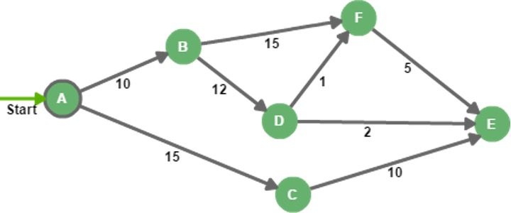
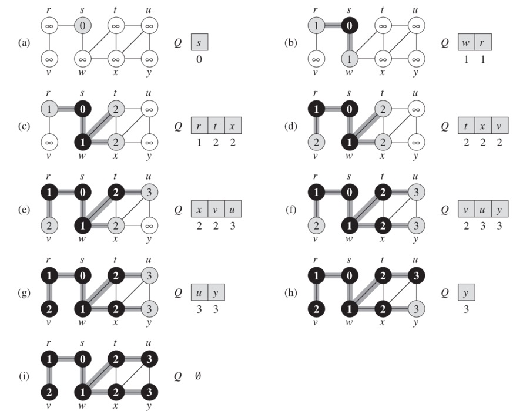
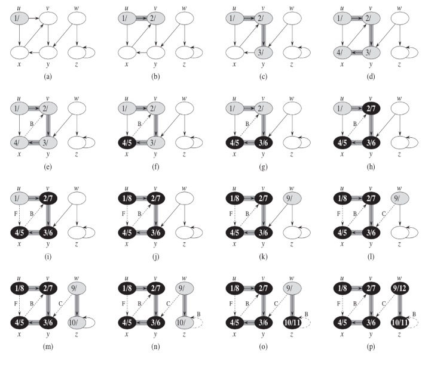
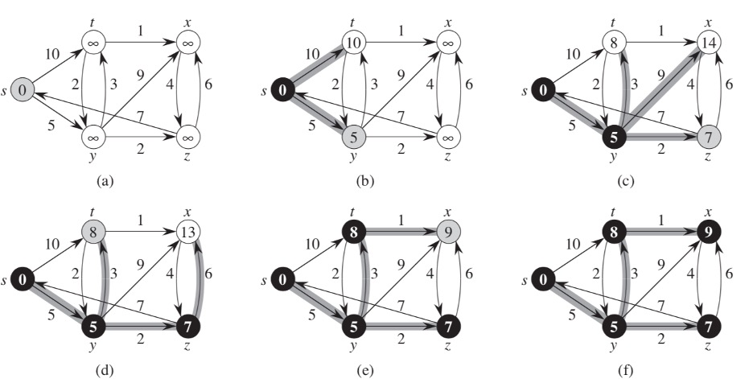

# 5. Graphs

Finishing theme of this lecture will be about graphs. All types of trees we looked at in this lecture are special cases of graphs. A graph is a data structure, that consists of finite set of vertices, together with a set of unordered pairs of these vertices for an undirected graph or a set of ordered pairs for a directed graph. These pairs are known as edges.

The **adjacency-list representation** of a graph `G = (V, E)` consists of an array Adj of `|V|` lists, one for each vertex in `V`. For each `u ϵ V`, the adjacency list `Adj[u]` contains all the vertices v such that there is an edge `(u,v) ϵ E`. That is, `Adj[u]` consists of all the vertices adjacent to `u` in `G`.
If `G` is a directed graph, the sum of the lengths of all the adjacency lists is `|E|`, since an edge of the form `(u, v)` is represented by having `v` appear in `Adj[u]`. If `G` is an undirected graph, the sum of the lengths of all the adjacency lists is `2|E|`.

We can readily adapt adjacency lists to represent weighted graphs, that is, graphs for which each edge has an associated weight, typically given by a weight function. For example, let `G = (V, E)` be a weighted graph with weight function `w`. We simply store the weight `w(u, v)` of the edge `(u, v) ϵ E` with vertex `v` in `u`s adjacency list. The adjacency-list representation is quite robust in that we can modify it to support many other graph variants.

Figure 5.1



Let's look at types of searches that can be performed on a graph.

## 5.1 BFS

**Breadth-first search** (BFS) is one of the simplest algorithms for searching a graph and the archetype for many important graph algorithms.

Given a graph `G = (V, E)` and a distinguished **source** vertex `s`, breadth-first search systematically explores the edges of `G` to discover every vertex that is reachable from `s`. It computes the distance (the smallest number of edges) from `s` to each reachable vertex. It also produces a _breadth-first tree_ with root s that contains all reachable vertices. For any vertex `v` reachable from `s`, the simple path in the breadth-first tree from `s` to `v` corresponds to _the shortest path_ from `s` to `v` in `G`, that is, a path containing the smallest number of edges. The algorithm works on both directed and undirected graphs.

The breadth-first-search procedure BFS below assumes that the input graph `G = (V, E)` is represented using adjacency lists. It attaches several additional attributes to each vertex in the graph. We store the color of each vertex `u ϵ V` in the attribute `u.color` and the predecessor of `u` in the attribute `u.p`. If `u` has no predecessor (for example, if `u = s` or `u` has not been discovered), then `u.p = null`. The attribute `u.d` holds the distance from the source `s` to vertex `u` computed by the algorithm. The algorithm also uses a first-in, first-out queue `Q` to manage the set of gray vertices.

```ts title="Listing 5.1 - BFS"
function BFS(G, s) {
  let u, v;

  for (u of G) {
    u.color = 'WHITE';
    u.d = Number.POSITIVE_INFINITY;
    u.p = null;
  }

  s.color = 'GRAY';
  s.d = 0;
  s.p = null;
  Q = [];
  Q.push(s);

  while (Q.length > 0) {
    u = Q.unshift();

    for (v of G.Adj[u]) {
      if (v.color === 'WHITE') {
        v.color = 'GRAY';
        v.d = u.d + 1;
        v.p = u;
        Q.push(Q, v)
      }
    }

    u.color = 'BLACK';
  }
}
```

Here is a visualization of this type of search.

Figure 5.2



## 5.2 DFS

The strategy followed by **depth-first search** (DFS) is, as its name implies, to search "deeper" in the graph whenever possible. Depth-first search explores edges out of the most recently discovered vertex v that still has unexplored edges leaving it. Once all of `v`s edges have been explored, the search "backtracks" to explore edges leaving the vertex from which `v` was discovered. This process continues until we have discovered all the vertices that are reachable from the original source vertex. If any undiscovered vertices remain, then depth-first search selects one of them as a new source, and it repeats the search from that source. The algorithm repeats this entire process until it has discovered every vertex.

```ts title="Listing 5.2 - DFS"
function DFS(G) {
  for (let u of G) {
    u.color = 'WHITE';
    u.p = null;
  }

  let time = 0;

  for (let u of G) {
    if (u.color === 'WHITE') {
      dfsVsisit(G, u);
    }
  }

  function dfsVsisit(G, u) {
    time++;
    u.d = time;
    u.color = 'GRAY';

    for (let v of G.Adj[u]) {
      if (v.color === 'WHITE') {
        v.p = u;
        dfsVsisit(G, v);
      }
    }

    u.color = 'BLACK';
    time++;
    u.f = time;
  }
}
```

Here is an example of steps performed in DFS.

Figure 5.3



## 5.3 Finding the Shortest Path

And now we are reaching the theme of your home task – search of the shortest path.

To find the shortest path in an unweighted graph, the best solution will be to use BFS. With weighted graphs the task becomes non-trivial. One of the most common tasks of searching a short path is a travelling salesman problem that asks the following question: "Given a list of cities and the distances between each pair of cities, what is the shortest possible route that visits each city exactly once and returns to the origin city?". The simplest way to find out is to use brute-force and try to find all permutations and see which one is the cheapest. The downside to this approach is its running time which lies within a polynomial factor of `O(n!)`, the factorial of the number of cities, so this solution becomes impractical even for only 20 cities.

Let us look at a different, much easier problem.

Professor Patrick wishes to find the shortest possible route from Phoenix to Indianapolis. Given a road map of the United States on which the distance between each pair of adjacent intersections is marked, how can she determine this shortest route?

One possible way would be to enumerate all the routes from Phoenix to Indianapolis, add up the distances on each route, and select the shortest. It is easy to see, however, that even disallowing routes that contain cycles, Professor Patrick would have to examine an enormous number of possibilities, most of which are simply not worth considering. For example, a route from Phoenix to Indianapolis that passes through Seattle is obviously a poor choice, because Seattle is several hundred miles out of the way.

In a **shortest-paths problem**, we are given a weighted, directed graph `G = (V, E)`, with weight function: `E -> R` mapping edges to real-valued weights. The weight `w(p)` of path `p = (v[0], v[1], …, v[k])` is the sum of the weights of its constituent edges:

<div className="formula">
  
</div>

One of the ways to solve this problem would be to use Dijkstra's algorithm.

## 5.4 Dijkstra's Algorithm

Dijkstra's algorithm solves the single-source shortest-paths problem on a weighted, directed graph `G = (V, Е)` for the case in which all edge weights are nonnegative. In this section, therefore, we assume that `w(u, v) > 0` for each edge `(u, v) ϵ Е`.

Dijkstra's algorithm maintains a set `S` of vertices whose final shortest-path weights from the source `s` have already been determined. The algorithm repeatedly selects the vertex u `2 V - S` with the minimum shortest-path estimate, adds `u` to `S`, and relaxes all edges leaving `u`. In the following implementation, we use a min-priority queue `Q` of vertices, keyed by their `d` values.

Dijkstra's algorithm can be implemented as following:

```ts title="Listing 5.3 - Dijkstra"
function Dijkstra(G, w, s) {
  initSingleSource(G, s);
  S = [];
  Q = G.V; // build queue with priorities according to d values of vertices

  while (Q) {
    let u = Q.extractMin();
    S.push(u);

    for (let vertex in G.Adj[u]) {
      relax(u, v, w);
    }
  }
}
```

Where functions `initSingleSource` and `relax` are defined like this:

```ts title="Listing 5.4 - initSingleSource and relax"
function initSingleSource(G, s) {
  for (let vertex of G) {
    v.d = Number.MAX_SAFE_INTEGER;
    v.p = null;
  }

  s.d = 0;
} 

function relax(u, v, w) {
  if (v.d > u.d + w(u, v)) {
    v.d = u.d + w(u, v);
    v.p = u;
  }
}
```

And here is a visualization of Dijkstra's algorithm.

The process of relaxing an edge `(u, v)` consists of testing whether we can improve the shortest path to `v` found so far by going through `u` and, if so, updating `v.d` and `v.p`.

Figure 5.4


