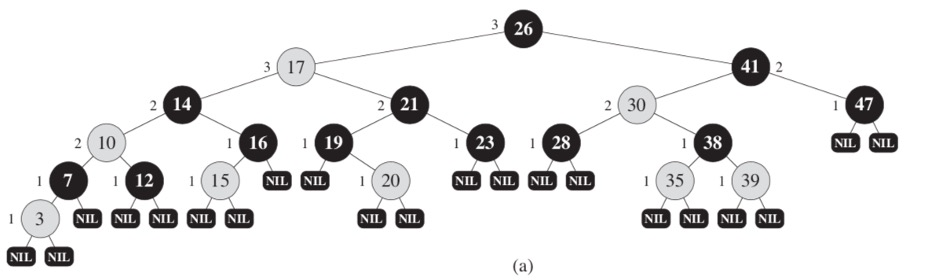
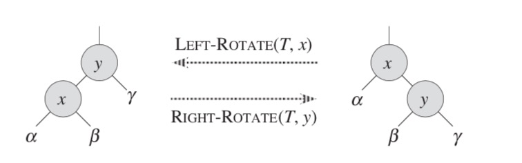
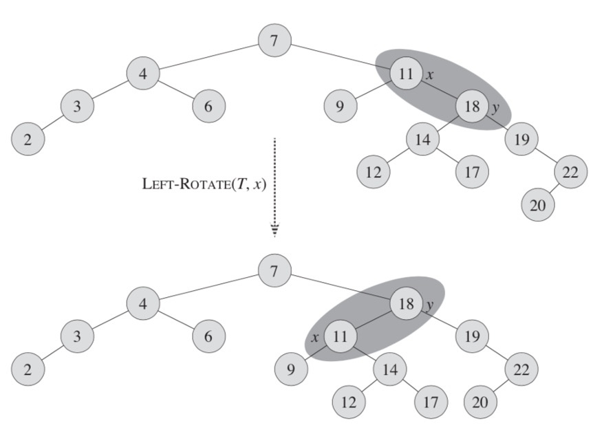
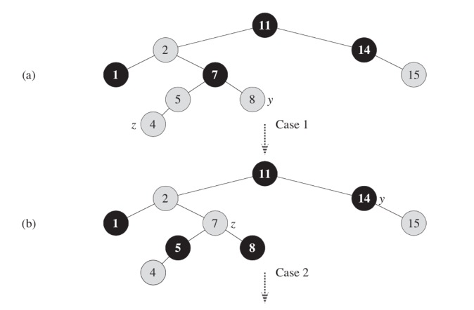
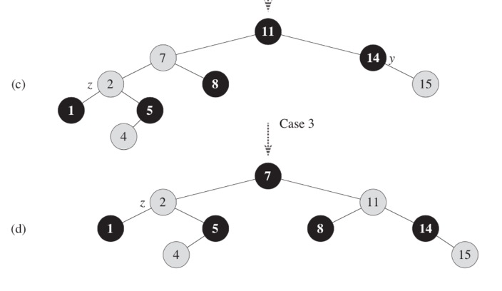

# 3. Red-Black Tree

A **red-black tree** is a binary search tree with one extra bit of storage per node: its color, which can be either RED or BLACK. By constraining the node colors on any simple path from the root to a leaf, red-black trees ensure that no such path is more than twice as long as any other, so that the tree is approximately **balanced**.

Each node of the tree now contains the attributes _color_, _key_, _left_, _right_, and _p_. If a child or the parent of a node does not exist, the corresponding pointer attribute of the node contains the value `null`. We shall regard these `null`s as being pointers to leaves (external nodes) of the binary search tree and the normal, key-bearing nodes as being internal nodes of the tree.

A red-black tree is a binary tree that satisfies the following **red-black properties**:
- Every node is either red or black.
- The root is black
- Every leaf (`null`) is black
- If a node is red, then both its children are black
- For each node, all simple paths from the node to descendant leaves contain the same number of black nodes.


:::info
A red-black tree also has a lemma: a tree with `n` internal nodes has height at most `2lg(n + 1)`. The proof of this lemma can be found in a book called "Algorithms + Data Structures = Programs" written by Niklaus Wirth.
:::

This is how a red-black tree looks.

Figure 3.1



## 3.1 Insert and Delete

The search-tree operations **TREE-INSERT** and **TREE-DELETE**, when run on a red-black tree with `n` keys, take `O(lgn)` time. Because they modify the tree, the result may violate the red-black properties. To restore these properties, we must change the colors of some nodes in the tree and also change the pointer structure.

Figure 3.2



We change the pointer structure through **rotation**, which is a local operation in a search tree that preserves the binary-search-tree property. Image below shows the two kinds of rotations: left rotations and right rotations. When we do a left rotation on a node `x`, we assume that its right child `y` is not `null`; `x` may be any node in the tree whose right child is not `null`. The left rotation "pivots" around the link from `x` to `y`. It makes `y` the new root of the subtree, with `x` as `y`s left child and `y`s left child as `x`s right child.

```ts title="Listing 3.1 - rotateLeft and rotateRight"
rotateLeft() {
  let y = this.right;
  this.right = y.left;

  if (!y.left.isNil) {
    y.left.parent = this;
  }

  if (!y.isNil) y.parent = this.parent;

  if (this.parent) {
    if (this.id == this.parent.left.id) {
      this.parent.left = y;
    } else {
      this.parent.right = y;
    }
  } else {
    this.tree.root = y;
  }

  y.left = this;
  if (!this.isNil) this.parent = y;
},
rotateRight() {
  let y = this.left;
  this.left = y.right;

  if (!y.right.isNil) {
    y.right.parent = this;
  }

  if (!y.isNil) y.parent = this.parent;

  if (this.parent) {
    if (this.id == this.parent.right.id) {
      this.parent.right = y;
    } else {
      this.parent.left = y;
    }
  } else {
    this.tree.root = y;
  }

  y.right = this;
  if (!this.isNil) this.parent = y;
}
```

This is how methods of left and right rotation are defined. They are completely symmetrical.

Figure 3.3



Here is a visualization of a rotation. In this example, we are rotating element `x` in a tree `T` left. After a rotation, the `y` element "pulls" its right subtree up (elements 19, 20, 22). Left subtree of `x` (9) stays the same, and left subtree of `y` becomes right subtree of `x`.

```ts title="Listing 3.2 - insertNode"
insertNode(data) {
  let current, parent, x;
  current = this.root;
  parent = null;

  while (!current.isNil) {
    if (data == current.value) return current;

    parent = current;
    current = data < current.value ? current.left : current.right;
  }

  x = new rbNode(this);
  x.value = data;
  x.parent = parent;
  x.isRed = true;
  x.isNil = false;

  x.left = new rbNode(this);
  x.right = new rbNode(this);

  if (parent) {
    if (x.value < parent.value) {
      parent.left = x;
    } else {
      parent.right = x;
    }
  } else {
    this.root = x;
  }

  this.insertFixup(x);

  return x;
}
```

To insert a node, first we have to find a place to insert it into. The new node will always be added as a leaf. This means that both of his children are NIL and are black. The newly added node will always be red. After insertion, we perform a `insertFixup` operation defined as following:

```ts title="Listing 3.3 - insertFixup"
insertFixup(x) {
  while (x.id != this.root.id && x.parent.isRed) {
    if (x.parent.id == x.parent.parent.left.id) {
      let y = x.parent.parent.right;

      if (y.isRed) {
        x.parent.isRed = false;
        y.isRed = false;
        x.parent.parent.isRed = true;
        x = x.parent.parent;
      } else {
        if (x.id == x.parent.right.id) {
          x = x.parent;
          x.rotateLeft();
        }

        x.parent.isRed = false;
        x.parent.parent.isRed = true;
        x.parent.parent.rotateRight();
      }
    } else {
      let y = x.parent.parent.left;

      if (y.isRed) {
        x.parent.isRed = false;
        y.isRed = false;
        x.parent.parent.isRed = true;
        x = x.parent.parent;
      } else {
        if (x.id == x.parent.left.id) {
          x = x.parent;
          x.rotateRight();
        }

        x.parent.isRed = false;
        x.parent.parent.isRed = true;
        x.parent.parent.rotateLeft();
      }
    }
  }

  this.root.isRed = false;
}
```

To perform the fixup, we have to look at the parent, and check if the red-black property is followed. If the parent node is black – we can exit. If it is red, we recolor it black and preform a rotation to balance the tree. By inserting a red node with 2 NIL-children, we are keeping the property of black height (property 4). Although, this could mean that we are breaking the property 3, according to which both children of a red node have to be black. So, let's look at a situation when a parent of a new node is red, by which the property 3 will be violated.

Let's look at 2 different cases:

_Case 1: Red parent, red "uncle"._ This is called red-red violation. The new node X has a red parent and a red "uncle" (the other sibling of parents' parent). A simple recolor will fix the red-red violation. After recoloring, we must check the "grandparent" of the new node because it could be red. Look at how the new red node influences nodes at the top. At the end we recolor the root node black. If it was red before, we increase the black height of the tree.

_Case 2: Red parent, black "uncle"._ This is the other case of red-red violation – the "uncle" of the new node is black. Here, the nodes could be rotated to correct the subtrees. At this point, the algorithm could exit because there are no red-red violations, and the root of the tree is painted black. Please note, that if the node `x` was the right sibling, then at first, the left rotation will be applied. It will make the new node the left sibling. Every correction, performed at insertion makes us go up a tree by one level.

The deletion of a node is analogous to insertion, but instead of looking at the uncle node, we look at the sibling of the deleted node. If you want to learn more about deletion, please look it [here](https://www.geeksforgeeks.org/red-black-tree-set-3-delete-2/).

Let us look at an example of insertion of a node.

Figure 3.4



Figure 3.5



At first (a), we insert a node `z` with value 4. It's inserted red, the parent of it is red and the uncle `t` is red too. To fix this red-red violation, we recolor the parent of `z` and `y` to black and make the parent red (transition a-b).

Now, we have a red-red violation, and we assume the previous grandparent node of `z` (7) as `z`. At this point, the uncle of `z` – `y` would be node 14. To fix this red-red violation, we perform a left-rotate on parent of the node `z` (transition b-c).

At this point we assume that the previous parent of `z` as `z` (node 2) and its uncle `y` is 14. The node 7 is still red, and we have the red-red violation. To fix it, we have to recolor parent of `z` to black, recolor grandparent of `z` to red and perform a right rotation on grandparent (transition c-b). At this point, since the parent element of `z` is black, we can be sure that the tree is balanced.
