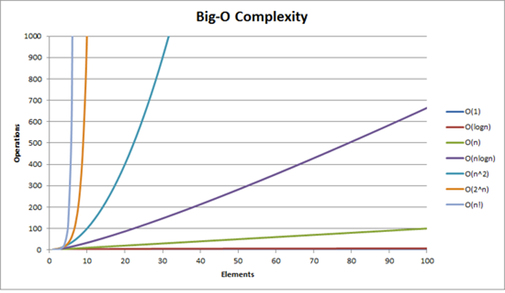

# 1. Algorithms

So, what is algorithm? Non-programmers joke, that this is a word used by programmers when they do not want to explain what they did.
Informally, an algorithm is any well-defined computational procedure that takes some value, or set of values as input and produces some value, or set of values, as output. An algorithm is thus a sequence of computational steps that transform the input into the output.

We can also view an algorithm as a tool for solving a well-specified computational problem. The statement of the problem specifies in general terms the desired input/output relationship. The algorithm describes a specific computational procedure for achieving that input/output relationship.

You may ask a question why do we need all this? We are qualified enough specialists and have not encountered them. In most projects, if you just take it and do it, then you really don't need them, program may work without it. But if you approach writing code in a meaningful way, it is necessary.
In fact, any code you write is an evaluation-based algorithm. It's not just sorting and other things. You have input data, and you give the result based on them. It is also important to understand how the language you are working with works. In JS example, it has a sort() function. If you look in the code, it uses the C++ quicksort function. And sometimes it makes sense not to use what has already been implemented, but implement our own sorting algorithm.

## 1.1 Algorithm Characteristics

Algorithms usually have a specific set of input values that it can work with to get a result. For example, sorting algorithms take collections of data values and try to order them.

You can also talk about the classification of an algorithm using a variety of criteria. Some algorithms operate on their datasets sequentially, which means they are sequential in nature. Whereas a parallel algorithm can split a dataset into smaller pieces and then work with each one at the same time.

The algorithm can be exact, in which case it produces a known predictable value, or it can be approximate, in which case it tries to find an answer that may not be. For example, a face recognition algorithm may not give the same answer every time with the same face.

Algorithms can be deterministic, in which case they perform each step with an exact solution, and it can be non-deterministic if they try to find a solution using consecutive guesses that become more accurate over time.

## 1.2 Common Algorithms

### 1.2.1 Search Algorithms

This kind of algorithms find specific data in structure. (for example, a substring within a string). One of the most common types of algorithms you come across is search algorithms, which are used when you need to find a piece of data within a larger data structure. For example, searching for a substring within a larger string, or perhaps searching for a file in a set of subfolders in the file system.

### 1.2.2 Sorting Algorithms

Take a dataset and apply a sort to order it. Sorting algorithms are another very common type used when working with ordered datasets. And, you guessed it, they take a dataset and put them in a specific order.

### 1.2.3 Computational Algorithms

Given one set of data, calculate another basing on this set. Computational algorithms are used to get from one dataset to another. And a simple example would be calculating whether a given number is a prime number, or perhaps converting a temperature from one scale to another.

### 1.2.4 Collection Algorithms

Work with collections of data (count specific items, navigate among data elements, filter out unwanted data etc.). Finally, there are collection algorithms that involve manipulating or navigating between sets of data that are stored in a particular structure. It's easy to imagine examples here that count the number of specific items, filter out unwanted data, and so on.

## 1.3 Algorithm Performance

Since algorithms are designed to work with datasets and solve computational problems, it is important to understand how to talk about the performance of an algorithm. This is an important factor in how you choose a particular algorithm for solving a computational problem, as well as understanding how your program will behave in different circumstances.

So, we want to measure how the performance of an algorithm changes based on the size of the input dataset. You will often hear a term called Big-O notation that is used to describe the performance of an algorithm. This notation format is used to describe how a particular algorithm works as the input data set grows over time. And the reason the letter O is used is that the rate at which the complexity of an algorithm grows is also called order of operation. It usually describes a worst-case scenario of how long it will take to complete a given operation. And it's important to note that many algorithms and data structures have more than one Big-O value. For example, data structures can usually perform several types of operations, such as inserting or searching for values, each with its own order of operations.

| Notation                  | Description | Example |
|---------------------------|---|---|
| `O(1)`                    | Constant time | Looking for a single element in an array knowing index |
| `O(logn)`                 | Logarithmic | Finding an item in a sorted array with a binary search |
| `O(n)`                    | Linear time | Searching an unsorted array of for a specific value |
| `O(nlogn)`                | Log-linear | Complex sorting algorithms like heap sort and merge sort |
| <code>O(n2)</code> | Quadratic | Simple sorting algorithms, such as bubble sort, selection sort |

So let's take a look at some common Big-O notation terms to see what they mean in real-world scenarios. Each of these items are arranged in ascending order of complexity of time.

The simplest example is what's called constant time, and this corresponds to a Big-O equal to one. And in essence, this means that the operation in question does not depend on the number of elements in a given dataset. A good example of this is calculating whether a number is even or odd, or looking for a specific index of an element in an array.

Next comes the order of log n, which is called logarithmic time. And a typical example of this kind of operations is searching for a specific value in a sorted array using binary search. Thus, as the number of elements in the sorted array grows, it only takes a logarithmic ratio of time to find any given element.

The next is linear time, which corresponds to Big-O of `n`, and this level of time complexity corresponds to a typical example of finding an element in an unsorted array.

We also have an order of `n` times `logn` or the so-called logarithmic time complexity. Examples would be some sorting algorithms such as heap sort and merge sort.

And finally, the order of `n` squared, which is called the quadratic time complexity, and as you probably guessed, this is not a very good level of performance, because it means that as the number of elements in the dataset increases, the time it takes to process they increase in the square of this number. An example would be several simpler sorting algorithms such as bubble sort and selective sort.

Figure 1.1

Believe it or not, there is actually even worse than quadratic dependence. But this is a good list of the levels of difficulty that you are likely to encounter in your work. As you can see, there is a graph (Figure 1.1) representatively showing how much the number of operations will change depending on the number of input elements.

## 1.4 Correctness of Algorithm

An algorithm is considered correct if, at any admissible (for a given problem) input, it finishes its work and produces a result that meets the requirements of the problem. In this case, the algorithm is said to solve the given computational problem. An incorrect algorithm (for some input) may not stop at all or give an incorrect result, but this does not mean that such algorithms are completely useless. If errors are rare enough, or it is possible to control the frequency of errors, we may admit the use of incorrect algorithms. It may be that initially we have a specific task with one data set, and we have compiled an algorithm. Then some new data begins to arrive, there are not many of them, but with them the algorithm slows down significantly. But since there is little such data so far, the algorithm is quite working.

## 1.5 Analyzing Algorithm

Analyzing an algorithm has come to mean predicting the resources that the algorithm requires. Occasionally, resources such as memory, communication bandwidth, or computer hardware are of primary concern, but most often it is computational time that we want to measure. Generally, by analyzing several candidate algorithms for a problem, we can identify a most efficient one. Such analysis may indicate more than one viable candidate, but we can often discard several inferior algorithms in the process.

Before we can analyze an algorithm, we must have a model of the implementation technology that we will use, including a model for the resources of that technology and their costs. For this lecture, we will assume a generic one processor, **random-access machine (RAM)** model of computation as our implementation technology and understand that our algorithms will be implemented as computer programs. In the RAM model, instructions are executed one after another, with no concurrent operations.
