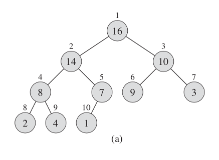
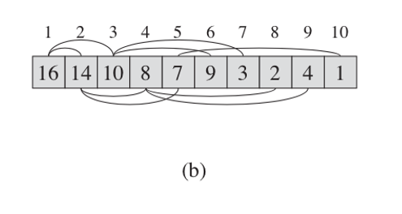
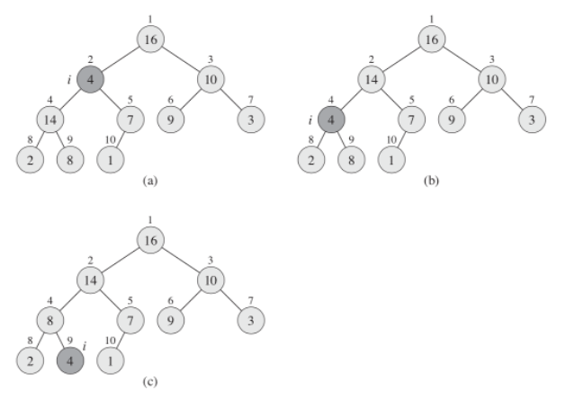
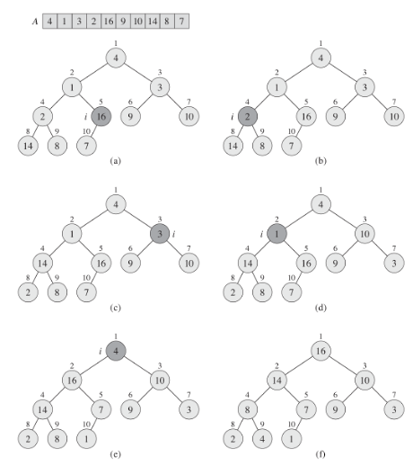
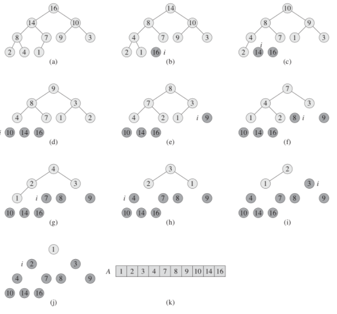

# 4. Heap. Heap Sort. Priority Queue

The **(binary) heap** data structure is an array object that we can view as a nearly complete binary tree. Each node of the tree corresponds to an element of the array. The tree is completely filled on all levels except possibly the lowest, which is filled from the left up to a point. An array `A` that represents a heap is an object with two attributes: `A.length`, which (as usual) gives the number of elements in the array, and A.heap-size, which represents how many elements in the heap are stored within array A. That is, although `A[1 .. A.length]` may contain numbers, only the elements in `A[1 .. A.heap-size]`, where `0 ≤ A.heap-size ≤ A.length`, are valid elements of the heap. The root of the tree is `A[1]`, and given the index i of a node, we can easily compute the indices of its parent, left child, and right child:
- Parent: `i/2`
- Left: `2i`
- Right: `2i + 1`

There are two kinds of binary heaps: max-heaps and min-heaps. In both kinds, the values in the nodes satisfy a **heap property**, the specifics of which depend on the kind of heap. In a **max-heap**, the **max-heap property** is that for every node i other than the root: `A[Parent(i)] ≥ A[i]`. Thus, the largest element in a max-heap is stored at the root, and the subtree rooted at a node contains values no larger than that contained at the node itself. A **min-heap** is organized in the opposite way; the **min-heap property** is that for every node i other than the root: `A[Parent(i)] ≤ A[i]`. The smallest element in a min-heap is at the root. For the heapsort algorithm, we use max-heaps. Min-heaps commonly implement priority queues.

## 4.1 Heap

What does this heap look like? We have an array that we can represent as a tree. The numbers above the element in the array and the heap are the same, you can see how they are substituted into the leaves.

Figure 4.1



Figure 4.2



It doesn't have to be an array, different programming languages have different data structures. For following example it is more convenient to consider it as an array.

```ts title="Figure 2.1"
function maxHeapify(A, i) {
  let l = left(i);
  let r = right(i);

  if (l <= A.heapSize && A[l] > A[i]) {
    largest = l;
  } else {
    largest = i;
  }

  if (r <= A.heapSize && A[r] > A[largest]) {
    largest = r;
  }

  if (largest != i) {
    // exchange A[i] with A[largest]
    [A[i], A[largest]] = [A[largest], A[i]];

    maxHeapify(A[largest]);
  }
}
```

Array `A`, which will represent our heap, also has attributes such as length - the number of elements in the array. And heap-size, the number of elements in the heap. The root of the tree is the first element in the array. We can easily calculate all the indexes of the nodes. The parent node or node is `i/2`. The left child is `2i` and the right is `2i + 1`.

There are two types of our heaps. If max hip has the largest root node and the heap goes down, min has a minimum root node and goes up.

For heap sorting, max heap is usually used, and min heap is used for building a priority queue.

## 4.2 Maintaining the Heap Property

In order to maintain the max-heap property, we call the function `maxHeapify`. When it is called, `maxHeapify` assumes that the binary trees rooted at `left(i)` and `right(i)` are max-heaps, but that `A[i]` might be smaller than its children, thus violating the max-heap property. Function `maxHeapify` lets the value at `A[i]` "float down" in the max-heap so that the subtree rooted at index `i` obeys the max-heap property.

Figure 4.3



This heap must somehow support itself, for example, when inserting or when deleting elements a heap rebuild should take place. We have a procedure, let's call it `maxHeapify`. When it is called, we assume that the left and right nodes are also maxHeap. But these nodes can be smaller than its children, and we have to let it go down below. As we can see, the second element has ceased to meet the requirement, and we check the left heap until we reach the sheet.

At each step, the largest of the elements `A[i]`, `A[left(i)]`, and `A[right(i)]` is determined, and its index is stored in largest. If `A[i]` is largest, then the subtree rooted at node `i` is already a max-heap and the procedure terminates. Otherwise, one of the two children has the largest element, and `A[i]` is swapped with `A[largest]`, which causes node `i` and its children to satisfy the max-heap property. The node indexed by `largest`, however, now has the original value `A[i]`, and thus the subtree rooted at largest might violate the max-heap property. Consequently, we call `maxHeapify` recursively on that subtree.

The running time of `maxHeapify` on a subtree of size `n` rooted at a given node `i` is the `Θ(1)` time to fix up the relationships among the elements `A[i]`, `A[left(i)]`, and `A[right(i)]`, plus the time to run `maxHeapify` on a subtree rooted at one of the children of node `i` (assuming that the recursive call occurs). The children's subtrees each have size at most `2n/3` - the worst case occurs when the bottom level of the tree is exactly half full—and therefore we can describe the running time of `maxHeapify` by the recurrence:

<div className="formula">
  
</div>

The solution to this recurrence, by case `2` of the master theorem is `T(n) = O(lgn)`.

And so, let's analyze the algorithm. We define the largest element of the three, then swap and so on, omit the element. For our first node, we have a Tetta from `n`. For a single node, then we split into under trees and go down under the trees. We have a maximum number of child subtrees, in the worst case, `2n/3`. This is when we go from half to the very bottom.
Thus, the following time is obtained: `T(n) = O(lgn)`. Turning to the master theorem, we get the result: `lg6 = 2.6`. This is a very good result, we need to spend less resources than our operations.

## 4.3 Building a Heap

The heap should be built using method `buildMaxHeap`. To do this, you need to run the entire array through the `maxHeapify` function. As we see the complexity becomes `nlg(n)`, we have a linear dependency - we apply a function for each element and call `maxHeapify` itself. We can use the procedure `maxHeapify` in a bottom-up manner to convert an array `A[1..n]`, where `n = A.length`, into a max-heap. The elements in the subarray `A[(n/2+1)..n]` are all leaves of the tree, and so each is a 1-element heap to begin with. The function `buildMaxHeap` goes through the remaining nodes of the tree and runs `maxHeapify` on each one.

We can compute a simple upper bound on the running time of buildMaxHeap:
- Each call to `maxHeapify` costs `O(lgn)` time.
- Procedure buildMaxHeap makes `O(n)` such calls.
- Thus, the running time is `O(nlgn)`. This upper bound, though correct, is not asymptotically tight.

Figure 4.4



We have an unsorted array, and we usually start in the middle. Each time the offset is made, the heap gets a complete look.

## 4.4 Heap Sort

The heapsort algorithm starts by using `buildMaxHeap` to build a max-heap on the input array `A[1..n]`, where `n = A.length`. Since the maximum element of the array is stored at the root `A[1]`, we can put it into its correct final position by exchanging it with `A[n]`. If we now discard node `n` from the heap — and we can do so by simply decrementing `A.heapSize` - we observe that the children of the root remain max-heaps, but the new root element might violate the max-heap property. All we need to do is to restore the max-heap property, however, is call `maxHeapify`, which leaves a max-heap in `A[1..n-1]`. The heapsort algorithm then repeats this process for the max-heap of size `n - 1` down to a heap of size `2`.

The heapsort procedure takes time `O(nlgn)` since the call to `buildMaxHeap` takes time `O(n)` and each of the `n - 1` calls to `maxHeapify` takes time `O(lgn)`.

Based on this data structure, we can build a sort algorithm called "heap sort". We have to build our heap from some dataset, and then starting from the first elements we put it in the first place and reduce the length with our heap, it remains in the array, but it is not part of the heap. Thus, each time we rebuild our heap, we will sort our array and each time we sort the smaller array. heapsort is thus executed for `nlgn`.

Figure 4.5



We take the first element and remove it from the heap when we put it first in the array. The tree is automatically rebuilt, now we take the first one again and put it in second place, and so on, until the heap ceases to exist and our array is completely sorted.

## 4.5 Priority Queue

A **priority queue** is a data structure for maintaining a set `S` of elements, each with an associated value called a **key**. A **max-priority queue** supports the following operations:
- `INSERT(S, x)` inserts the element `x` into the set `S`.
- `MAXIMUM(S)` returns the element of `S` with the largest key.
- `EXTRACT-MAX(S)` removes and returns the element of `S` with the largest key.
- `INCREASE-KEY(S, x, k)` increases the value of element `x`s key to the new value `k`, which is assumed to be at least as large as `x`s current key value.

This is a very good sort, but in most cases it is not the most optimal sort. But for some reason we are considering it, and all because on the basis of the heap it is very good to build a queue with priority. This is how it is implemented in most programs. For example, where you can use this queue - schedule a job on the server or use an event-driven approach when modeling physical processes with great complexity. For example, an event occurs with a minimum priority, it is executed, the time is recalculated, inserted into the queue, and the event we need appears at the top. Also, there are queues with the highest priority or with the lowest. You can insert an element into it, you can take the maximum element, extract the maximum element, and you can change the priority of some element. For example, processor time, there is a queue of tasks that it executes in one clock cycle, it performs a task, the priority changes - we insert it into the queue and take it with the next priority.
