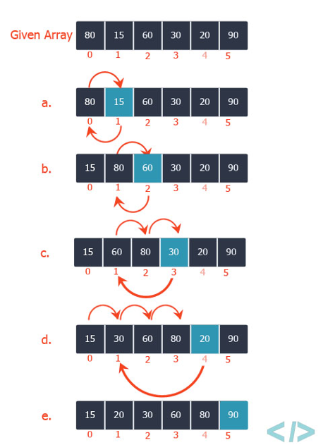
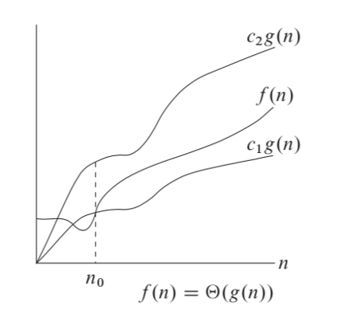
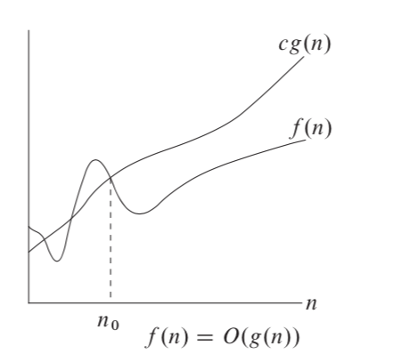
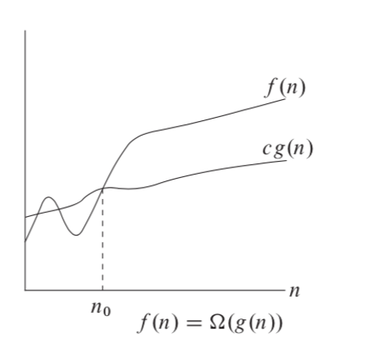

import CodeEmbedLink from '@site/src/components/CodeEmbedLink';

# 2. Insertion Sort

Insertion sort is a simple sorting algorithm that works similar to the way you sort playing cards in your hands. The array is virtually split into a sorted and an unsorted part. Values from the unsorted part are picked and placed at the correct position in the sorted part.

To sort an array of size n in ascending order (Figure 2.1):
- Iterate from `arr[1]` to `arr[n]` over the array.
- Compare the current element (key) to its predecessor.
- If the key element is smaller than its predecessor, compare it to the elements before. Move the greater elements one position up to make space for the swapped element.

Figure 2.1



The running time of the `insertionSort` procedure depends on the set of input values: it takes longer to sort thousands of numbers than to sort three numbers. In the general case, the running time of the algorithm increases with an increase in the amount of input data, so it is a common practice to represent the running time of a program as a function depending on the number of input elements. For this, the concepts of "algorithm time" and "size of input data" need to be determined more precisely.

The most adequate concept of input data size depends on the problem in question. For each task considered below, the way of measuring the size of the input data will be indicated. In the case of insertion sort, the number of input elements is considered as the size of the input data.

The running time of an algorithm on a particular input is the number of primitive operations or "steps" executed. It is convenient to define the notion of step so that it is as machine-independent as possible. For the moment, let us adopt the following view. A constant amount of time is required to execute each line of our code.

In the following discussion, our expression for the running time of insertion sort will evolve from a messy formula that uses all the statement costs _c<sub>i</sub>_ to a much simpler notation that is more concise and more easily manipulated. This simpler notation will also make it easy to determine whether one algorithm is more efficient than another.

To begin with, we introduce for the insertionSort procedure a time "cost" of each instruction and the number of their repetitions. Let <code>t<sub>j</sub></code> be the number of condition checks in the while loop. If the for and while loops are completed normally (that is, when the condition specified in the loop header ceases to be met), the condition is checked for one more time than the loop body is executed.

Listing 2.1 - Insertion sort

````mdx-code-block
<CodeEmbedLink
  title="Insertion sort"
  src="https://codesandbox.io/embed/insertion-sort-p4g1bn?expanddevtools=1&fontsize=14&hidenavigation=1&theme=dark"
/>
````

This is the insertion sort implementation, but we have placed the `C` with the index and the number of repetitions how many times we pay this price.

The running time of the algorithm is the sum of running times for each statement executed; a statement that takes <code>c<sub>i</sub></code> steps to execute and executes `n` times will contribute <code>c<sub>i</sub>n</code> to the total running time. To compute `T(n)` the running time of `insertionSort` on an input of `n` values, we sum the products of the cost and times columns, obtaining:

<div className="formula">
  
</div>

Even for inputs of a given size, an algorithm's running time may depend on which input of that size is given. For example, in `insertionSort`, the best case occurs if the array is already sorted. For each `j = 2, 3, …, n` we then find that <code>A<sub>i</sub> ≤ key</code> in line 4 when `i` has its initial value of `j-1`. Thus, <code>t<sub>j</sub>=1</code> for <code>j=2, 3, …, n</code> and the best-case running time is:

<div className="formula">
  
</div>

We can express this running time as `an + b` for constants `a` and `b` that depend on the statement costs <code>c<sub>i</sub></code>. It is thus a linear function of _n_.
If the array is in reverse sorted order - that is, in decreasing order - the worst case results. We must compare each element <code>A<sub>i</sub></code> with each element in the entire sorted subarray <code>A<sub>1..j-1</sub></code>, and so <code>t<sub>j</sub>=j</code> for `j=2, 3, …, n`. The worst case, the running time of `insertionSort` is:

<div className="formula">
  
</div>

We can express this worst-case running time as an^2+bn+c for constants a, b, and c that again depend on the statement costs <code>c<sub>i</sub></code>. It is thus a **quadratic function** of `n`.

In our analysis of insertion sort, we looked at both the best case, in which the input array was already sorted, and the worst case, in which the input array was reverse sorted. For the remainder of this book, though, we shall usually concentrate on finding only the worst-case running time, that is, the longest running time for any input of size `n`. We give three reasons for this orientation.

The worst-case running time of an algorithm gives us an upper bound on the running time for any input. Knowing it provides a guarantee that the algorithm will never take any longer. We need not make some educated guess about the running time and hope that it never gets much worse.

For some algorithms, the worst case occurs fairly often. For example, in searching a database for a particular piece of information, the searching algorithm's worst case will often occur when the information is not present in the database. In some applications, searches for absent information may be frequent.

The "average case" is often roughly as bad as the worst case. Suppose that we randomly choose n numbers and apply insertion sort. How long does it take to determine where in subarray <code>A<sub>(1..j-1)</sub></code> to insert element <code>A<sub>j</sub></code>? On average, half the elements in <code>A<sub>(1..j-1)</sub></code> are less than <code>A<sub>j</sub></code>, and half the elements are greater. On average, therefore, we check half of the <code>A<sub>(1..j-1)</sub></code>, and so <code>t<sub>j</sub></code> is about `j/2`. The resulting average-case running time turns out to be a quadratic function of the input size, just like the worst-case running time.

In some particular cases, we shall be interested in the average-case running time of an algorithm; you could look for the technique of probabilistic analysis applied to various algorithms. The scope of average-case analysis is limited, because it may not be apparent what constitutes an "average" input for a particular problem. Often, we shall assume that all inputs of a given size are equally likely. In practice, this assumption may be violated, but we can sometimes use a randomized algorithm, which makes random choices, to allow a probabilistic analysis and yield an expected running time.

We used some simplifying abstractions to ease our analysis of the `insertionSort` procedure. First, we ignored the actual cost of each statement, using the constants <code>c<sub>i</sub></code> to represent these costs. Then, we observed that even these constants give us more detail than we really need: we expressed the worst-case running time as <code>an<sup>2</sup> + bn + c</code> for some constants `a`, `b`, and `c` that depend on the statement costs <code>c<sub>i</sub></code>. We thus ignored not only the actual statement costs, but also the abstract costs <code>c<sub>i</sub></code>.

We shall now make one more simplifying abstraction: it is the rate of growth, or order of growth, of the running time that really interests us. We therefore consider only the leading term of a formula (e.g., <code>an<sup>2</sup></code>), since the lower-order terms are relatively insignificant for large values of `n`. We also ignore the leading term's constant coefficient, since constant factors are less significant than the rate of growth in determining computational efficiency for large inputs. For insertion sort, when we ignore the lower-order terms and the leading term's constant coefficient, we are left with the factor of <code>n<sup>2</sup></code> from the leading term. We write that insertion sort has a worst-case running time of <code>θ(n<sup>2</sup>)</code>.

We usually consider one algorithm to be more efficient than another if its worst case running time has a lower order of growth. Due to constant factors and lower order terms, an algorithm whose running time has a higher order of growth might take less time for small inputs than an algorithm whose running time has a lower order of growth. But for large enough inputs, a <code>θ(n<sup>2</sup>)</code> algorithm, for example, will run more quickly in the worst case than a <code>θ(n<sup>3</sup>)</code> algorithm.

We found that the worst-case running time of insertion sort is <code>T(n) = θ(n<sup>2</sup>)</code>. Let us formalize what this notation means.

## 2.1 Asymptotic Notation

Consider what theta is. We found our worst case <code>𝜃(n<sup>2</sup>)</code>. For a given function `g(n)` - that is, for our algorithm. We denote `𝜃(g(n))` as the set of the following functions when there is a set of positive constants `C` and <code>n<sub>0</sub></code> such that the inequality holds for every n greater than zero. Theta is an accurate estimate (it must be bounded at both the top and bottom). For example, an algorithm requiring `Ω(nlogn)` requires at least `nlogn` time, but the upper bound is not known. An algorithm requiring `Θ(nlogn)` is preferable because it requires at least `nlogn(Ω(nlogn))` and at most `nlogn(O(nlogn))`.

For a given function `g(n)` we denote by `θ(g(n))` the set of functions:

`θ(g(n)) = { f(n)`: there exist positive constants <code>c<sub>1</sub></code>, <code>c<sub>2</sub></code> and <code>n<sub>0</sub></code> such that <code>0 ≤ c<sub>1</sub>g(n) ≤ f(n) ≤ c<sub>2</sub>g(n)</code> for all <code>n ≥ n<sub>0</sub> }</code>

Figure 2.2



Theta notation is asymptotically tied to top and bottom functions, that is, it keeps it in a narrower framework. If we only have an upper bound, we use big O notation. For the functions `g(n)`, a positive constant must be satisfied and the inequality holds for each `n` greater than `0`. O large is most useful because it represents the worst case.

For a given function `g(n)` we denote by `θ(g(n))` the set of functions:

`Ω(g(n)) = { f(n)`: there exist positive constants `c`, and <code>n<sub>0</sub></code> such that `0 ≤ cg(n) ≤ f(n)` for all <code>n ≥ n<sub>0</sub> }</code>

Figure 2.3



Omega notation. If big O is notation for the upper bound, then omega is for the lower one. It is defined in a similar way to big O, but we restrict the function from below. That is, we show the best implementation, for example, an already sorted collection in the input.

Figure 2.4



After that, you can already analyze your code, put down the execution time, etc. We've covered `insertionSort` using an incremental approach, i.e. each time we took the next element and considered for each sorted array. We remember that the quadratic option is not the best and let's see what else we can use.
