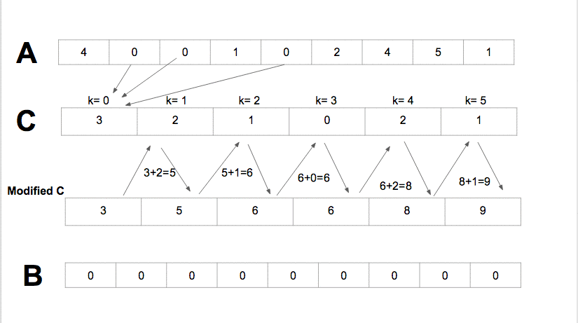
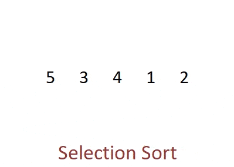

# 5. Other sorting algorithms

There are many other sorting algorithms. The following table provides an overview of some sorting algorithms. It is a selection of the most common sorting algorithms.

| Algorithm          | Time best case                | Time avg case                 | Time worst case               | Space      |
| ------------------ | ----------------------------- | ----------------------------- | ----------------------------- | ---------- |
| **Quicksort**      | `O(n log n)`                  | `O(n log n)`                  | <code>O(n2)</code> | `O(log n)` |
| **Bubble Sort**    | `O(n)`                        | <code>O(n2)</code> | <code>O(n2)</code> | `O(1)`     |
| **Counting Sort**  | `O(n + k)`                    | `O(n + k)`                    | `O(n + k)`                    | `O(n + k)` |
| **Selection Sort** | <code>O(n2)</code> | <code>O(n2)</code> | <code>O(n2)</code> | `O(1)`     |

- Some of them, like **Quicksort** and **Merge Sort** alongside with **Heap Sort** are based on the divide and conquer principle and are considered efficient sorting algorithms that achieve a much better time complexity of `Θ(nlogn)` and therefore, also suitable for large data sets with billions of elements.
-  **Quicksort** picks an element as a pivot and partitions the array based on the pivot. How to pick pivot?
    - Always pick the first element as a pivot
    - Always pick the last element as a pivot (implemented below)
    - Pick a random element as a pivot
    - Pick median as a pivot

The partition process is a key process. Choose x element as pivot, put x and its position in a sorted array, then put all smaller elements before the pivot, and all larger elements after the pivot.

- **Bubble Sort** algorithm is the most straightforward way of sorting, it has the suboptimal characteristics, but it is easy to perceive.

- **Counting Sort** sorts the elements of an array by counting the number of occurrences of each unique element in the array. It has the linear time and will take `O(k + n)` (where `k` is the value of the max element in the input array) time to finish, but it is efficient if the range of input data is not significantly greater than the number of elements to be sorted.

- **Selection Sort** sorts elements by picking a minimum element from an unsorted subarray and putting it at the beginning of the sorted subarray (considering ascending order).

:::warning Article
If you are interested in more algorithms you can find useful information in the [article](https://www.happycoders.eu/algorithms/sorting-algorithms/).
:::
